# Chapter 2: State & Events

> Static pages are boring. Let's make TaskFlow interactive — adding tasks, completing them, deleting them, and filtering by status. This chapter is where React stops feeling like a templating language and starts feeling like magic.

> **📌 Prerequisites:** You've completed Chapter 1 — TaskFlow renders a hardcoded list of `<TaskCard />` components with proper keys.

---

## 🧠 Concepts

### 1. useState: Making Components Remember

In Chapter 0, we learned that `UI = f(state)`. But so far, our TaskFlow has no state — it's a pure function of hardcoded data. Time to change that.

`useState` is a **hook** — a special function that lets you "hook into" React features from function components. It gives your component memory.

```tsx
const [value, setValue] = useState(initialValue);
//     ↑        ↑                    ↑
//  current   updater           starting value
//  value     function
```

When you call `setValue(newValue)`:
1. React stores the new value
2. Schedules a re-render of this component
3. On re-render, `useState` returns the new value

```mermaid
%%{init: {'theme':'default'}}%%
flowchart LR
    R1["**RENDER #1**<br/><br/>count = 0<br/>‹button›<br/>Count: 0"]
    E["**EVENT**<br/><br/>setCount(1)<br/>stores new value"]
    R2["**RENDER #2**<br/><br/>count = 1<br/>‹button›<br/>Count: 1"]
    R1 -- "click" --> E -- "react re-runs<br/>component" --> R2
    R2 -. "cycle continues..." .-> R1
```



**Think of it like a photograph vs. a video.** Each render is a "snapshot" — a photograph of your UI at a moment in time. `useState` is the dial that advances to the next frame.

#### Primitives

```tsx
const [count, setCount] = useState(0);
const [name, setName] = useState('');
const [isOpen, setIsOpen] = useState(false);
```

#### Objects

```tsx
interface User {
  name: string;
  email: string;
  age: number;
}

const [user, setUser] = useState<User>({
  name: 'Alice',
  email: 'alice@example.com',
  age: 28,
});

// Update ONE field — spread the rest
setUser({ ...user, age: 29 });
// equivalently: setUser(prev => ({ ...prev, age: prev.age + 1 }))
```

#### Arrays

```tsx
const [items, setItems] = useState<string[]>(['apple', 'banana']);

// Add
setItems([...items, 'cherry']);

// Remove
setItems(items.filter((item) => item !== 'banana'));

// Update one
setItems(items.map((item) => item === 'apple' ? 'APPLE' : item));
```

#### Lazy Initialization

If your initial state is expensive to compute, pass a **function** — it only runs on the first render:

```tsx
// ❌ This runs JSON.parse on EVERY render (wasted)
const [tasks, setTasks] = useState(JSON.parse(localStorage.getItem('tasks') ?? '[]'));

// ✅ This runs JSON.parse only on the FIRST render
const [tasks, setTasks] = useState(() =>
  JSON.parse(localStorage.getItem('tasks') ?? '[]')
);
```

> **💡 Vercel Best Practice:** Always use lazy initialization (`useState(() => ...)`) when the initial value involves computation — parsing JSON, reading localStorage, calculating from props. It's a free performance win.

---

### 2. State Immutability: The Cardinal Rule

This is the most common source of bugs for React beginners. **Never mutate state directly.** Always create a new value.

#### Why?

React detects changes by **reference comparison** (`===`). If you mutate an object, the reference stays the same, and React thinks nothing changed:

```tsx
// ❌ MUTATION — React won't re-render!
const handleComplete = () => {
  tasks[0].completed = true; // same array, same objects
  setTasks(tasks);           // same reference → React: "nothing changed 🤷"
};

// ✅ NEW REFERENCE — React re-renders!
const handleComplete = () => {
  setTasks(tasks.map((task, i) =>
    i === 0 ? { ...task, completed: true } : task
  ));
};
```

#### The Immutable Operations Cheat Sheet

| Operation | ❌ Mutating | ✅ Immutable |
|-----------|------------|-------------|
| Add to array | `arr.push(item)` | `[...arr, item]` |
| Remove from array | `arr.splice(i, 1)` | `arr.filter(x => x.id !== id)` |
| Update in array | `arr[i].done = true` | `arr.map(x => x.id === id ? {...x, done: true} : x)` |
| Update object field | `obj.name = 'new'` | `{...obj, name: 'new'}` |
| Update nested object | `obj.address.city = 'NYC'` | `{...obj, address: {...obj.address, city: 'NYC'}}` |

**Burn this table into your brain.** You'll use these patterns hundreds of times.

#### Functional Updates

When your new state depends on the previous state, use the **functional form** of the setter:

```tsx
// ⚠️ This might be stale if called multiple times rapidly
setCount(count + 1);

// ✅ This always uses the latest value
setCount((prev) => prev + 1);
```

Why? React batches state updates for performance. If you call `setCount(count + 1)` three times in one event handler, `count` is the same stale value each time, so you get `+1` instead of `+3`. The functional form fixes this.

---

### 3. Event Handling

React events work like DOM events, with a few twists:

#### Inline Handlers

```tsx
<button onClick={() => console.log('clicked!')}>Click me</button>
```

#### Named Handlers

```tsx
const Counter = () => {
  const [count, setCount] = useState(0);

  const handleClick = () => {
    setCount((prev) => prev + 1);
  };

  return <button onClick={handleClick}>Count: {count}</button>;
}
```

**Notice: `onClick={handleClick}` not `onClick={handleClick()}`!**

- `onClick={handleClick}` — passes the function (called on click) ✅
- `onClick={handleClick()}` — calls the function immediately during render ❌

#### Event Types in TypeScript

React provides typed event objects:

```tsx
const handleChange = (e: React.ChangeEvent<HTMLInputElement>) => {
  console.log(e.target.value);
};

const handleSubmit = (e: React.FormEvent<HTMLFormElement>) => {
  e.preventDefault(); // prevent page reload
  // handle form submission
};

const handleKeyDown = (e: React.KeyboardEvent<HTMLInputElement>) => {
  if (e.key === 'Enter') {
    // submit
  }
};
```

#### Passing Arguments to Handlers

When you need to pass data (like a task ID) to a handler:

```tsx
// ✅ Arrow function creates a new handler for each item
{tasks.map((task) => (
  <button key={task.id} onClick={() => deleteTask(task.id)}>
    Delete {task.title}
  </button>
))}
```

---

### 4. Controlled Components

A **controlled component** is a form element whose value is driven by React state. React is the "single source of truth" — the input displays what state says.

```tsx
const SearchBox = () => {
  const [query, setQuery] = useState('');

  return (
    <input
      type="text"
      value={query}                                    // controlled by state
      onChange={(e) => setQuery(e.target.value)}       // state updated on input
      placeholder="Search tasks..."
    />
  );
}
```

The flow is:
1. User types "a"
2. `onChange` fires → `setQuery('a')`
3. Component re-renders → `value` is now `'a'`
4. Input displays "a"

This feels circular, but it gives you full control: you can validate, transform, or reject input in real-time.

```tsx
// Force uppercase
<input
  value={name}
  onChange={(e) => setName(e.target.value.toUpperCase())}
/>

// Limit to 50 characters
<input
  value={title}
  onChange={(e) => {
    if (e.target.value.length <= 50) {
      setTitle(e.target.value);
    }
  }}
/>
```

**Every form input in TaskFlow will be controlled.** It's the React way.

---

### 5. Conditional Rendering Patterns

You already saw these in Chapter 1, but let's solidify with real examples now that we have state:

#### Ternary — Two alternatives

```tsx
{isEditing ? (
  <input value={title} onChange={(e) => setTitle(e.target.value)} />
) : (
  <span>{title}</span>
)}
```

#### Early Return — Don't render this component

```tsx
const TaskList = ({ tasks }: { tasks: Task[] }) => {
  if (tasks.length === 0) {
    return <p className="empty">No tasks yet. Add one above! ☝️</p>;
  }

  return (
    <div className="task-list">
      {tasks.map((task) => (
        <TaskCard key={task.id} task={task} />
      ))}
    </div>
  );
}
```

#### Ternary over `&&` (Vercel tip)

```tsx
// ❌ Renders "0" if tasks.length is 0
{tasks.length && <TaskList tasks={tasks} />}

// ✅ Renders null if falsy
{tasks.length > 0 ? <TaskList tasks={tasks} /> : null}
```

> **💡 Vercel Best Practice:** The `&&` pattern is a minefield. `0 && <Component />` renders `0`. `"" && <Component />` renders an empty string. These are valid JSX values that show up in the DOM. Always use ternary with an explicit `null` for the falsy case, or coerce to boolean: `{!!count && <Component />}`.

---

### 6. Deriving State (Don't Store What You Can Compute)

A common mistake is creating state for values that can be **computed** from existing state:

```tsx
// ❌ BAD — redundant state, easy to get out of sync
const [tasks, setTasks] = useState<Task[]>([]);
const [completedCount, setCompletedCount] = useState(0);
const [filteredTasks, setFilteredTasks] = useState<Task[]>([]);

// ✅ GOOD — derive during render
const [tasks, setTasks] = useState<Task[]>([]);
const [filter, setFilter] = useState<'all' | 'active' | 'completed'>('all');

const completedCount = tasks.filter((t) => t.completed).length;
const filteredTasks = filter === 'all'
  ? tasks
  : tasks.filter((t) => filter === 'completed' ? t.completed : !t.completed);
```

Derived values are computed fresh every render — for free. No state to sync, no bugs.

> **💡 Vercel Best Practice:** If you can calculate a value from existing state or props during render, don't store it in state. This eliminates an entire class of bugs where your "cached" state falls out of sync with the source of truth.

---

## 💡 Examples

### Example 1: Counter with Multiple Operations

```tsx
const Counter = () => {
  const [count, setCount] = useState(0);

  return (
    <div>
      <h2>Count: {count}</h2>
      <button onClick={() => setCount((c) => c - 1)}>−</button>
      <button onClick={() => setCount(0)}>Reset</button>
      <button onClick={() => setCount((c) => c + 1)}>+</button>
    </div>
  );
}
```

### Example 2: Object State — Profile Editor

```tsx
interface Profile {
  name: string;
  bio: string;
  location: string;
}

const ProfileEditor = () => {
  const [profile, setProfile] = useState<Profile>({
    name: '',
    bio: '',
    location: '',
  });

  const handleChange = (field: keyof Profile, value: string) => {
    setProfile((prev) => ({ ...prev, [field]: value }));
  };

  return (
    <form>
      <input
        value={profile.name}
        onChange={(e) => handleChange('name', e.target.value)}
        placeholder="Name"
      />
      <textarea
        value={profile.bio}
        onChange={(e) => handleChange('bio', e.target.value)}
        placeholder="Bio"
      />
      <input
        value={profile.location}
        onChange={(e) => handleChange('location', e.target.value)}
        placeholder="Location"
      />
      <pre>{JSON.stringify(profile, null, 2)}</pre>
    </form>
  );
}
```

### Example 3: Array State — Tag Manager

```tsx
const TagManager = () => {
  const [tags, setTags] = useState<string[]>(['react', 'typescript']);
  const [input, setInput] = useState('');

  const addTag = () => {
    const trimmed = input.trim().toLowerCase();
    if (trimmed && !tags.includes(trimmed)) {
      setTags((prev) => [...prev, trimmed]);
      setInput('');
    }
  };

  const removeTag = (tag: string) => {
    setTags((prev) => prev.filter((t) => t !== tag));
  };

  return (
    <div>
      <div>
        <input
          value={input}
          onChange={(e) => setInput(e.target.value)}
          onKeyDown={(e) => e.key === 'Enter' && addTag()}
          placeholder="Add tag..."
        />
        <button onClick={addTag}>Add</button>
      </div>
      <div>
        {tags.map((tag) => (
          <span key={tag} className="tag">
            {tag}
            <button onClick={() => removeTag(tag)}>×</button>
          </span>
        ))}
      </div>
    </div>
  );
}
```

---

## 🔨 Project Task: Interactive TaskFlow

Let's add full interactivity to TaskFlow — adding tasks, marking them complete, deleting them, and filtering.

### Step 1: Add State to App

Update `src/App.tsx` — replace the hardcoded array with state:

```tsx
import { useState } from 'react';
import TaskCard from './components/TaskCard';
import type { Task } from './types';

const INITIAL_TASKS: Task[] = [
  { id: '1', title: 'Learn React fundamentals', completed: true, createdAt: new Date('2026-01-15') },
  { id: '2', title: 'Build TaskFlow app', completed: false, createdAt: new Date('2026-02-01') },
  { id: '3', title: 'Master TypeScript', completed: false, createdAt: new Date('2026-02-03') },
];

type Filter = 'all' | 'active' | 'completed';

const App = () => {
  const [tasks, setTasks] = useState<Task[]>(INITIAL_TASKS);
  const [filter, setFilter] = useState<Filter>('all');

  // Derived state — not stored, computed
  const filteredTasks = filter === 'all'
    ? tasks
    : tasks.filter((t) => (filter === 'completed' ? t.completed : !t.completed));

  const activeCount = tasks.filter((t) => !t.completed).length;

  // Handlers
  const addTask = (title: string) => {
    const newTask: Task = {
      id: crypto.randomUUID(),
      title,
      completed: false,
      createdAt: new Date(),
    };
    setTasks((prev) => [newTask, ...prev]);
  };

  const toggleTask = (id: string) => {
    setTasks((prev) =>
      prev.map((task) =>
        task.id === id ? { ...task, completed: !task.completed } : task
      )
    );
  };

  const deleteTask = (id: string) => {
    setTasks((prev) => prev.filter((task) => task.id !== id));
  };

  return (
    <div className="app">
      <h1>📋 TaskFlow</h1>
      <p>{activeCount} {activeCount === 1 ? 'task' : 'tasks'} remaining</p>

      <TaskForm onAdd={addTask} />

      <TaskFilters current={filter} onChange={setFilter} />

      <div className="task-list">
        {filteredTasks.length > 0 ? (
          filteredTasks.map((task) => (
            <TaskCard
              key={task.id}
              task={task}
              onToggle={() => toggleTask(task.id)}
              onDelete={() => deleteTask(task.id)}
            />
          ))
        ) : (
          <p className="empty">
            {filter === 'all' ? 'No tasks yet. Add one!' : `No ${filter} tasks.`}
          </p>
        )}
      </div>
    </div>
  );
}

export default App;
```

### Step 2: Create `<TaskForm />`

Create `src/components/TaskForm.tsx`:

```tsx
import { useState } from 'react';

interface TaskFormProps {
  onAdd: (title: string) => void;
}

const TaskForm = ({ onAdd }: TaskFormProps) => {
  const [title, setTitle] = useState('');

  const handleSubmit = (e: React.FormEvent) => {
    e.preventDefault();
    const trimmed = title.trim();
    if (!trimmed) return;
    onAdd(trimmed);
    setTitle('');
  };

  return (
    <form onSubmit={handleSubmit} className="task-form">
      <input
        type="text"
        value={title}
        onChange={(e) => setTitle(e.target.value)}
        placeholder="What needs to be done?"
        autoFocus
      />
      <button type="submit" disabled={!title.trim()}>
        Add Task
      </button>
    </form>
  );
}

export default TaskForm;
```

Note:
- `e.preventDefault()` stops the form from refreshing the page
- Input is **controlled** — `value` tied to state
- Button is disabled when input is empty (derived from state, not stored)
- After adding, we clear the input by resetting state

### Step 3: Create `<TaskFilters />`

Create `src/components/TaskFilters.tsx`:

```tsx
type Filter = 'all' | 'active' | 'completed';

interface TaskFiltersProps {
  current: Filter;
  onChange: (filter: Filter) => void;
}

const FILTERS: Filter[] = ['all', 'active', 'completed'];

const TaskFilters = ({ current, onChange }: TaskFiltersProps) => {
  return (
    <div className="task-filters">
      {FILTERS.map((f) => (
        <button
          key={f}
          className={current === f ? 'active' : ''}
          onClick={() => onChange(f)}
        >
          {f.charAt(0).toUpperCase() + f.slice(1)}
        </button>
      ))}
    </div>
  );
}

export default TaskFilters;
```

### Step 4: Update `<TaskCard />`

Update `src/components/TaskCard.tsx` to support toggling and deleting:

```tsx
import type { Task } from '../types';

interface TaskCardProps {
  task: Task;
  onToggle: () => void;
  onDelete: () => void;
}

const TaskCard = ({ task, onToggle, onDelete }: TaskCardProps) => {
  return (
    <div className="task-card">
      <input
        type="checkbox"
        checked={task.completed}
        onChange={onToggle}
      />
      <span className={task.completed ? 'completed' : ''}>
        {task.title}
      </span>
      <button className="delete-btn" onClick={onDelete} aria-label="Delete task">
        🗑️
      </button>
    </div>
  );
}

export default TaskCard;
```

### Step 5: Add Styles

Add these to `src/index.css`:

```css
.task-form {
  display: flex;
  gap: 0.5rem;
  margin: 1rem 0;
}

.task-form input {
  flex: 1;
  padding: 0.5rem 0.75rem;
  border: 2px solid #e2e8f0;
  border-radius: 6px;
  font-size: 1rem;
}

.task-form input:focus {
  outline: none;
  border-color: #3b82f6;
}

.task-form button {
  padding: 0.5rem 1rem;
  background: #3b82f6;
  color: white;
  border: none;
  border-radius: 6px;
  cursor: pointer;
  font-weight: 600;
}

.task-form button:disabled {
  opacity: 0.5;
  cursor: not-allowed;
}

.task-filters {
  display: flex;
  gap: 0.25rem;
  margin: 1rem 0;
}

.task-filters button {
  padding: 0.35rem 0.75rem;
  border: 1px solid #e2e8f0;
  background: white;
  border-radius: 6px;
  cursor: pointer;
  font-size: 0.875rem;
}

.task-filters button.active {
  background: #3b82f6;
  color: white;
  border-color: #3b82f6;
}

.task-card {
  display: flex;
  align-items: center;
  gap: 0.75rem;
  padding: 0.75rem 1rem;
  background: white;
  border-radius: 8px;
  box-shadow: 0 1px 3px rgba(0, 0, 0, 0.08);
  margin-bottom: 0.5rem;
}

.task-card span {
  flex: 1;
}

.task-card .completed {
  text-decoration: line-through;
  opacity: 0.5;
}

.task-card input[type="checkbox"] {
  width: 1.1rem;
  height: 1.1rem;
  cursor: pointer;
}

.delete-btn {
  background: none;
  border: none;
  cursor: pointer;
  font-size: 1.1rem;
  opacity: 0.4;
  transition: opacity 0.2s;
}

.delete-btn:hover {
  opacity: 1;
}

.empty {
  text-align: center;
  color: #94a3b8;
  margin: 2rem 0;
}
```

### Step 6: Verify

Run `npm run dev` and test:

- ✅ Type in the input and click "Add Task" — task appears
- ✅ Click the checkbox — task gets strikethrough
- ✅ Click the trash icon — task disappears
- ✅ Click filter buttons — list filters correctly
- ✅ Counter updates as you complete/delete tasks

---

## 🧪 Challenge

1. **"Clear completed" button** — add a button that removes all completed tasks at once. Only show it when there are completed tasks (use ternary!).

2. **Edit task title** — double-click a task title to turn it into an input. Press Enter or blur to save, Escape to cancel. You'll need a new piece of state: `editingId: string | null`.

3. **Undo delete** — when a task is deleted, show a toast "Task deleted. Undo?" for 3 seconds. Clicking "Undo" restores it. Hint: you'll need to store the last deleted task in state and use `setTimeout`.

4. **Keyboard shortcuts** — press `/` to focus the add-task input. You'll need `useRef` (preview of Chapter 10) and a `keydown` event listener.

---

## 📚 Further Reading

- [React docs: State — A Component's Memory](https://react.dev/learn/state-a-components-memory) — the official useState guide
- [React docs: Updating Objects in State](https://react.dev/learn/updating-objects-in-state) — immutability patterns for objects
- [React docs: Updating Arrays in State](https://react.dev/learn/updating-arrays-in-state) — immutability patterns for arrays
- [React docs: Responding to Events](https://react.dev/learn/responding-to-events) — event handling deep dive
- [React docs: Conditional Rendering](https://react.dev/learn/conditional-rendering) — all the patterns

---

**Next up: [Chapter 3 — Component Composition →](/chapters/03-component-composition)**

TaskFlow works, but all the logic is crammed into `App.tsx`. Time to learn how to break an app into well-structured, reusable components.
