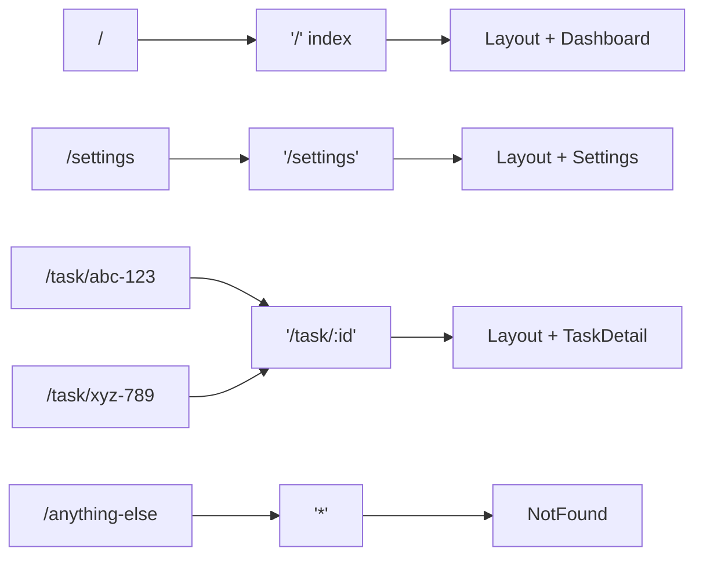

# Chapter 7: React Router — Navigation & Multi-Page Apps

> Your TaskFlow app currently lives on a single page. Real apps have *pages* — a dashboard, detail views, settings. React Router gives your SPA the feel of a traditional website with URLs, back/forward navigation, and bookmarkable views — without full page reloads.

> **📌 Where we are:** TaskFlow has clean custom hooks (Ch 6) — `useLocalStorage`, `useTasks`, `useFilteredTasks`, `useTheme`. Everything works, but it's all crammed onto one page. You can't link to a specific task or have a dedicated settings page.

> **📌 We're using React Router v7** — the latest version with a modernized API. If you see v5/v6 patterns online (like `<Switch>` or `element={}` without JSX), ignore them.

---

## 🧠 Concepts

### 1. SPAs Need Routing

A **Single Page Application** loads one HTML file and swaps content with JavaScript. Without routing, your entire app lives at one URL (`/`). That means:

- Users can't bookmark a specific task
- The back button doesn't work as expected
- You can't share a link to a particular view
- Deep linking is impossible

React Router solves this by **mapping URLs to components**. When the URL changes, React Router renders the matching component — no page reload, no server round-trip.

```
URL: /                  → <Dashboard />
URL: /task/abc-123      → <TaskDetail id="abc-123" />
URL: /settings          → <Settings />
```

### 2. How Client-Side Routing Works

Traditional websites: every link triggers an HTTP request → server returns a new HTML page.

SPA routing: JavaScript **intercepts** link clicks, updates the browser URL using the History API (`pushState`/`replaceState`), and React Router renders the matching component.

```
User clicks link → Router intercepts → URL updates → Component renders
                   (no page reload)    (History API)  (React re-render)
```

The browser's address bar changes, back/forward buttons work, but the page never actually reloads.

### 3. The Router Hierarchy

React Router uses a component-based approach. Here's the hierarchy:

```
<BrowserRouter>           ← Wraps your entire app, enables routing
  <Routes>                ← Container for route definitions
    <Route path="/" element={<Layout />}>    ← Parent route (layout)
      <Route index element={<Dashboard />} />  ← Default child route
      <Route path="task/:id" element={<TaskDetail />} /> ← Dynamic route
      <Route path="settings" element={<Settings />} />
    </Route>
    <Route path="*" element={<NotFound />} />  ← Catch-all 404
  </Routes>
</BrowserRouter>
```

**`BrowserRouter`** — Uses the browser's History API for clean URLs (`/task/123`). There's also `HashRouter` (`/#/task/123`) for environments without server-side URL rewriting, but `BrowserRouter` is the standard choice.

**`Routes`** — Evaluates all `<Route>` children and renders the **best match**. Only one route matches at a time (unlike v5 where order mattered more).

**`Route`** — Maps a `path` to an `element` (a React component).

Here's how URLs map to components:



> `:id` is a "dynamic segment" — matches any value, accessible via `useParams()`

### 4. Nested Routes & Layouts

This is where React Router shines. **Nested routes** let you create persistent layouts — a sidebar that stays visible while the main content changes.

```mermaid
%%{init: {'theme':'default'}}%%
block-beta
  columns 3
  block:layout["&lt;Layout /&gt;"]:3
    block:nav["Nav<br/>───<br/>Home<br/>Tasks<br/>Settings"]:1
    end
    space
    block:outlet["&lt;Outlet /&gt;<br/><br/>(child route renders here)"]:1
    end
  end
```

The parent route renders a `<Layout />` component with an `<Outlet />`. The child route's component gets rendered *inside* that `<Outlet />`. The layout persists — navigation, sidebar, header — while only the content area changes.

### 5. Dynamic Segments

URLs with variable parts use **dynamic segments** (prefixed with `:`):

```
/task/:id       →  matches /task/abc-123, /task/42, /task/anything
/user/:userId/task/:taskId  →  matches /user/5/task/12
```

Inside the component, you read these with `useParams()`:

```tsx
const { id } = useParams();  // { id: "abc-123" }
```

### 6. Navigation Methods

Three ways to navigate:

| Method | Use Case |
|--------|----------|
| `<Link to="/settings">` | Replaces `<a>` tags — no page reload |
| `<NavLink to="/settings">` | Like `<Link>` but adds active styling |
| `useNavigate()` | Programmatic navigation (after form submit, etc.) |

**`<Link>`** vs `<a>`**: Always use `<Link>` for internal navigation. Regular `<a>` tags trigger a full page reload, defeating the purpose of an SPA.

---

## 💡 Examples

### Basic Router Setup

```tsx
// src/main.tsx
import { BrowserRouter } from "react-router-dom";
import { createRoot } from "react-dom/client";
import App from "./App";

createRoot(document.getElementById("root")!).render(
  <BrowserRouter>
    <App />
  </BrowserRouter>
);
```

```tsx
// src/App.tsx
import { Routes, Route } from "react-router-dom";
import Dashboard from "./pages/Dashboard";
import Settings from "./pages/Settings";

const App = () => {
  return (
    <Routes>
      <Route path="/" element={<Dashboard />} />
      <Route path="/settings" element={<Settings />} />
    </Routes>
  );
}
```

### Navigation with Link and NavLink

```tsx
import { Link, NavLink } from "react-router-dom";

const Sidebar = () => {
  return (
    <nav>
      {/* Basic link */}
      <Link to="/">Home</Link>

      {/* NavLink — adds "active" class automatically */}
      <NavLink
        to="/"
        className={({ isActive }) =>
          isActive ? "nav-link active" : "nav-link"
        }
      >
        Dashboard
      </NavLink>

      <NavLink
        to="/settings"
        className={({ isActive }) =>
          isActive ? "nav-link active" : "nav-link"
        }
      >
        Settings
      </NavLink>
    </nav>
  );
}
```

### Dynamic Routes with useParams

```tsx
import { useParams } from "react-router-dom";

interface Task {
  id: string;
  title: string;
  description: string;
}

const TaskDetail = () => {
  const { id } = useParams<{ id: string }>();

  // In a real app, you'd fetch or look up the task by id
  // For now, we'll use context or props from the parent
  return (
    <div>
      <h1>Task: {id}</h1>
      <p>Details for task {id} go here.</p>
    </div>
  );
}
```

### Programmatic Navigation with useNavigate

```tsx
import { useNavigate } from "react-router-dom";

const TaskForm = () => {
  const navigate = useNavigate();

  function handleSubmit(data: TaskFormData) {
    // Save the task...
    createTask(data);

    // Navigate to the dashboard after saving
    navigate("/");

    // Or navigate to the new task's detail page
    // navigate(`/task/${newTask.id}`);

    // Go back (like pressing browser back button)
    // navigate(-1);
  }

  return <form onSubmit={handleSubmit}>{/* ... */}</form>;
}
```

### Nested Routes with Outlet

```tsx
// src/App.tsx
import { Routes, Route } from "react-router-dom";
import Layout from "./components/Layout";
import Dashboard from "./pages/Dashboard";
import TaskDetail from "./pages/TaskDetail";
import Settings from "./pages/Settings";
import NotFound from "./pages/NotFound";

const App = () => {
  return (
    <Routes>
      <Route path="/" element={<Layout />}>
        {/* index = default child route (renders at "/") */}
        <Route index element={<Dashboard />} />
        <Route path="task/:id" element={<TaskDetail />} />
        <Route path="settings" element={<Settings />} />
      </Route>
      {/* Outside the layout — 404 page has no sidebar */}
      <Route path="*" element={<NotFound />} />
    </Routes>
  );
}
```

```tsx
// src/components/Layout.tsx
import { Outlet, NavLink } from "react-router-dom";

const Layout = () => {
  return (
    <div className="app-layout">
      <aside className="sidebar">
        <h2>TaskFlow</h2>
        <nav>
          <NavLink to="/" end>
            Dashboard
          </NavLink>
          <NavLink to="/settings">Settings</NavLink>
        </nav>
      </aside>
      <main className="main-content">
        {/* Child route renders here! */}
        <Outlet />
      </main>
    </div>
  );
}
```

> **Tip:** The `end` prop on `<NavLink to="/">` ensures it's only "active" at exactly `/`, not for every route (since all routes start with `/`).

### Linking to Dynamic Routes

```tsx
import { Link } from "react-router-dom";

const TaskCard = ({ task }: { task: Task }) => {
  return (
    <Link to={`/task/${task.id}`} className="task-card">
      <h3>{task.title}</h3>
      <p>{task.status}</p>
    </Link>
  );
}
```

---

## 🔨 Project Task: Add Pages to TaskFlow

Time to turn TaskFlow from a single-page component into a proper multi-page app.

### Step 1: Install React Router

```bash
npm install react-router-dom
```

### Step 2: Create the Page Components

Create a `src/pages/` directory with three pages:

**`src/pages/Dashboard.tsx`**
```tsx
import { useContext } from "react";
import { Link } from "react-router-dom";
import { TaskContext } from "../context/TaskContext";

const Dashboard = () => {
  const { tasks } = useContext(TaskContext);

  return (
    <div className="dashboard">
      <div className="dashboard-header">
        <h1>Dashboard</h1>
        <p>{tasks.length} tasks total</p>
      </div>

      <div className="task-summary">
        <div className="summary-card">
          <h3>To Do</h3>
          <span className="count">
            {tasks.filter((t) => t.status === "todo").length}
          </span>
        </div>
        <div className="summary-card">
          <h3>In Progress</h3>
          <span className="count">
            {tasks.filter((t) => t.status === "in-progress").length}
          </span>
        </div>
        <div className="summary-card">
          <h3>Done</h3>
          <span className="count">
            {tasks.filter((t) => t.status === "done").length}
          </span>
        </div>
      </div>

      <div className="task-list">
        <h2>All Tasks</h2>
        {tasks.map((task) => (
          <Link key={task.id} to={`/task/${task.id}`} className="task-row">
            <span className="task-title">{task.title}</span>
            <span className={`badge badge-${task.status}`}>{task.status}</span>
          </Link>
        ))}
      </div>
    </div>
  );
}
```

**`src/pages/TaskDetail.tsx`**
```tsx
import { useParams, useNavigate, Link } from "react-router-dom";
import { useContext } from "react";
import { TaskContext } from "../context/TaskContext";

const TaskDetail = () => {
  const { id } = useParams<{ id: string }>();
  const { tasks, deleteTask } = useContext(TaskContext);
  const navigate = useNavigate();

  const task = tasks.find((t) => t.id === id);

  if (!task) {
    return (
      <div className="not-found">
        <h2>Task not found</h2>
        <p>No task with ID "{id}" exists.</p>
        <Link to="/">← Back to Dashboard</Link>
      </div>
    );
  }

  function handleDelete() {
    if (window.confirm("Delete this task?")) {
      deleteTask(task!.id);
      navigate("/");
    }
  }

  return (
    <div className="task-detail">
      <Link to="/" className="back-link">← Back to Dashboard</Link>

      <div className="task-detail-card">
        <div className="task-detail-header">
          <h1>{task.title}</h1>
          <span className={`badge badge-${task.status}`}>{task.status}</span>
        </div>

        {task.description && (
          <p className="task-description">{task.description}</p>
        )}

        <div className="task-meta">
          <p><strong>Priority:</strong> {task.priority}</p>
          <p><strong>Created:</strong> {new Date(task.createdAt).toLocaleDateString()}</p>
        </div>

        <div className="task-actions">
          <Link to={`/task/${task.id}/edit`} className="btn btn-primary">
            Edit Task
          </Link>
          <button onClick={handleDelete} className="btn btn-danger">
            Delete Task
          </button>
        </div>
      </div>
    </div>
  );
}
```

**`src/pages/Settings.tsx`**
```tsx
import { useContext } from "react";
import { ThemeContext } from "../context/ThemeContext";

const Settings = () => {
  const { theme, toggleTheme } = useContext(ThemeContext);

  return (
    <div className="settings">
      <h1>Settings</h1>

      <section className="settings-section">
        <h2>Appearance</h2>
        <div className="setting-row">
          <label>Theme</label>
          <button onClick={toggleTheme} className="btn">
            {theme === "light" ? "🌙 Switch to Dark" : "☀️ Switch to Light"}
          </button>
        </div>
      </section>

      <section className="settings-section">
        <h2>About TaskFlow</h2>
        <p>A task management app built with React 19.</p>
        <p>Version 0.7.0</p>
      </section>
    </div>
  );
}
```

### Step 3: Create the Layout Component

**`src/components/Layout.tsx`**
```tsx
import { Outlet, NavLink } from "react-router-dom";

const Layout = () => {
  return (
    <div className="app-layout">
      <aside className="sidebar">
        <div className="sidebar-header">
          <h1>📋 TaskFlow</h1>
        </div>
        <nav className="sidebar-nav">
          <NavLink
            to="/"
            end
            className={({ isActive }) =>
              `nav-item ${isActive ? "nav-item-active" : ""}`
            }
          >
            📊 Dashboard
          </NavLink>
          <NavLink
            to="/settings"
            className={({ isActive }) =>
              `nav-item ${isActive ? "nav-item-active" : ""}`
            }
          >
            ⚙️ Settings
          </NavLink>
        </nav>
      </aside>
      <main className="main-content">
        <Outlet />
      </main>
    </div>
  );
}
```

### Step 4: Wire Up the Router

Update your entry point to wrap the app in `BrowserRouter`:

**`src/main.tsx`**
```tsx
import { StrictMode } from "react";
import { createRoot } from "react-dom/client";
import { BrowserRouter } from "react-router-dom";
import App from "./App";
import { TaskProvider } from "./context/TaskContext";
import { ThemeProvider } from "./context/ThemeContext";
import "./index.css";

createRoot(document.getElementById("root")!).render(
  <StrictMode>
    <BrowserRouter>
      <ThemeProvider>
        <TaskProvider>
          <App />
        </TaskProvider>
      </ThemeProvider>
    </BrowserRouter>
  </StrictMode>
);
```

**`src/App.tsx`**
```tsx
import { Routes, Route } from "react-router-dom";
import Layout from "./components/Layout";
import Dashboard from "./pages/Dashboard";
import TaskDetail from "./pages/TaskDetail";
import Settings from "./pages/Settings";

const App = () => {
  return (
    <Routes>
      <Route path="/" element={<Layout />}>
        <Route index element={<Dashboard />} />
        <Route path="task/:id" element={<TaskDetail />} />
        <Route path="settings" element={<Settings />} />
      </Route>
      <Route path="*" element={<NotFound />} />
    </Routes>
  );
}

const NotFound = () => {
  return (
    <div className="not-found-page">
      <h1>404</h1>
      <p>Page not found.</p>
      <a href="/">Go home</a>
    </div>
  );
}
```

### Step 5: Add Basic Layout Styles

Add to your CSS:

```css
/* Layout */
.app-layout {
  display: flex;
  min-height: 100vh;
}

.sidebar {
  width: 240px;
  background: #1a1a2e;
  color: white;
  padding: 1.5rem;
  display: flex;
  flex-direction: column;
}

.sidebar-header h1 {
  font-size: 1.25rem;
  margin-bottom: 2rem;
}

.sidebar-nav {
  display: flex;
  flex-direction: column;
  gap: 0.25rem;
}

.nav-item {
  padding: 0.75rem 1rem;
  border-radius: 0.5rem;
  color: #a0a0b0;
  text-decoration: none;
  transition: background 0.2s;
}

.nav-item:hover {
  background: rgba(255, 255, 255, 0.1);
  color: white;
}

.nav-item-active {
  background: rgba(255, 255, 255, 0.15);
  color: white;
  font-weight: 600;
}

.main-content {
  flex: 1;
  padding: 2rem;
  overflow-y: auto;
}
```

### Step 6: Verify

- Navigate to `/` → Dashboard renders with task summary cards
- Click a task → URL changes to `/task/{id}`, detail page shows
- Click "Settings" in sidebar → Settings page renders
- Browser back button works correctly
- Refresh on `/task/some-id` → detail page still renders (no 404)
- NavLink highlights the active page

> **⚠️ Vite Dev Server Note:** Add this to `vite.config.ts` so direct URL access works during development:
> ```ts
> export default defineConfig({
>   plugins: [react()],
>   server: {
>     // Redirect all requests to index.html for client-side routing
>     historyApiFallback: true, // Vite does this by default, but good to know!
>   },
> });
> ```
> Vite's dev server already handles this, but in production you'll need your web server (nginx, Vercel, etc.) configured for SPA fallback.

---

## 🧪 Challenge

1. **Search params:** Add a filter to the Dashboard URL — `/dashboard?status=todo` — using `useSearchParams()`. Filter the task list based on the URL.

2. **Protected routes:** Create a wrapper component that checks if the user is "logged in" (just use a boolean in context) and redirects to `/login` with `<Navigate to="/login" />` if not.

3. **Animated transitions:** Look into `react-router-dom`'s integration with view transitions or `framer-motion` to animate page changes.

---

## 📚 Further Reading

- [React Router v7 Documentation](https://reactrouter.com/) — the official docs
- [React Router Tutorial](https://reactrouter.com/en/main/start/tutorial) — hands-on tutorial from the React Router team
- [History API on MDN](https://developer.mozilla.org/en-US/docs/Web/API/History_API) — understand what's happening under the hood
- [Vite SPA Fallback](https://vitejs.dev/config/server-options.html) — configuring Vite for client-side routing

---

**Next up: [Chapter 8 — Forms & Validation →](/chapters/08-forms-validation)**

We'll replace our basic form with React Hook Form, add Zod validation, and explore React 19's powerful new form primitives.
