# Chapter 0: React Architecture & Mental Models

> Before you write a single line of React, understand how it thinks. This chapter has **zero code to write** — just concepts to absorb. Everything here will click deeper once you start building.

> **📌 This course uses React 19** (released December 2024). We'll use its latest APIs throughout. Where React 19 simplifies something that used to be painful, we'll show the "before vs after" so you understand what changed and why.

---

## 🧠 Concepts

### 1. The Problem React Solves

Imagine building a live sports scoreboard in plain JavaScript. Every time a score changes, you need to:

1. Find the right DOM element (`document.getElementById(...)`)
2. Update its text
3. Maybe add/remove a CSS class for animation
4. If a new player enters, create new elements
5. If a player leaves, remove elements
6. Make sure you don't accidentally break other parts of the page

This is **imperative programming** — you tell the browser *step by step* what to do.

```js
// Imperative: manually updating the DOM
const scoreEl = document.getElementById('score-home');
scoreEl.textContent = '3';
scoreEl.classList.add('score-changed');
setTimeout(() => scoreEl.classList.remove('score-changed'), 1000);

if (newPlayer) {
  const li = document.createElement('li');
  li.textContent = newPlayer.name;
  document.getElementById('player-list').appendChild(li);
}
```

Now imagine this for a full app with hundreds of interactive elements. It becomes a nightmare of manual DOM manipulation — and bugs happen when your DOM gets out of sync with your data.

**React's big idea:** What if you just described what the UI *should look like* for any given data, and let something else figure out the DOM updates?

```jsx
// Declarative: describe what you want
const Scoreboard = ({ homeScore, players }) => {
  return (
    <div>
      <span className="score">{homeScore}</span>
      <ul>
        {players.map(p => <li key={p.id}>{p.name}</li>)}
      </ul>
    </div>
  );
}
```

You never touch the DOM. You just say "given this data, here's what the UI looks like." React handles the rest.

**This is declarative programming.** It's the single most important mental shift in React.

---

### 2. UI as a Function of State

React's core formula:

```
UI = f(state)
```

Your UI is the **output** of a function. The **input** is your application state (data). When state changes, the function runs again, and you get new UI.

```
state: { count: 0 }  →  f(state)  →  <button>Count: 0</button>
state: { count: 1 }  →  f(state)  →  <button>Count: 1</button>
state: { count: 2 }  →  f(state)  →  <button>Count: 2</button>
```

This is why React components are literally JavaScript functions:

```jsx
const Counter = ({ count }) => {    // Input: state/props
  return <button>Count: {count}</button>;  // Output: UI
}
```

**Key insight:** You never *modify* the UI. You modify the *state*, and React recomputes the UI. This is why it's called React — it *reacts* to state changes.

---

### 3. Components: The Building Blocks

A React app is a **tree of components**. Each component is responsible for one piece of UI.

```
        <App>
       /     \
  <Header>   <Main>
    |        /     \
  <Logo>  <TaskList>  <Sidebar>
          /    |    \
     <Task> <Task> <Task>
```

Components can:
- **Receive data** from their parent (via "props")
- **Manage their own data** (via "state")
- **Return UI** (JSX — which looks like HTML but isn't)
- **Contain other components** (composition)

**Think of it like LEGO.** Each brick (component) is self-contained and reusable. You compose small bricks into bigger structures.

#### Props: Data Flows Down

Data flows in **one direction** — from parent to child, via props.

```
<App>                        state: { tasks: [...] }
  ↓ passes tasks as prop
<TaskList tasks={tasks}>
  ↓ passes individual task
<Task title={task.title}>
```

A child component **cannot** modify its parent's data. It can only *request* changes by calling functions the parent passed down. This one-way flow makes bugs predictable — you always know where data came from.

```
Parent ──props──→ Child
Parent ←─callback─ Child (child calls a function from parent)
```

**Why one-way?** Two-way data binding (like old Angular) sounds convenient, but creates spaghetti — when anything can change anything, debugging is hell. One-way flow means you can trace any piece of data back to its source.

---

### 4. JSX: Not HTML, Not a String

JSX looks like HTML but it's actually JavaScript. This:

```jsx
const element = <h1 className="title">Hello, {name}</h1>;
```

Gets compiled (by Babel/SWC) into this:

```js
const element = React.createElement('h1', { className: 'title' }, `Hello, ${name}`);
```

Which produces a plain JavaScript object:

```js
{
  type: 'h1',
  props: {
    className: 'title',
    children: 'Hello, Murtu'
  }
}
```

**These objects are called React elements.** They're lightweight descriptions of what should be on screen. They are NOT actual DOM nodes. This distinction is crucial for understanding the next section.

Key JSX differences from HTML:
- `className` instead of `class` (because `class` is reserved in JS)
- `htmlFor` instead of `for`
- `{}` for JavaScript expressions: `{2 + 2}`, `{user.name}`, `{isLoggedIn && <Dashboard />}`
- Self-closing tags required: ``, `<input />`
- CamelCase for attributes: `onClick`, `onChange`, `tabIndex`

---

### 5. The Virtual DOM & Reconciliation

This is the engine room. Here's how React actually updates the screen:

#### Step 1: Trigger

Something causes a re-render:
- Initial render (app loads)
- State change (`setState`)
- Parent re-renders (child re-renders too)

#### Step 2: Render

React calls your component function. It returns JSX, which becomes a tree of React elements (plain JS objects). This tree is the **Virtual DOM** — a lightweight copy of what the UI *should* look like.


#### Step 3: Reconciliation (Diffing)

React compares the new virtual DOM with the previous one. It finds the **minimum set of changes**:

```mermaid
%%{init: {'theme':'default'}}%%
graph LR
  subgraph prev["PREVIOUS VDOM"]
    P1["&lt;div&gt;"] --> P2["&lt;h1&gt; '2'"]
    P1 --> P3["&lt;ul&gt;"]
    P3 --> P4["&lt;li&gt; 'A'"]
    P3 --> P5["&lt;li&gt; 'B'"]
  end
  subgraph new2["NEW VDOM"]
    N1["&lt;div&gt;"] --> N2["&lt;h1&gt; '3'"]
    N1 --> N3["&lt;ul&gt;"]
    N3 --> N4["&lt;li&gt; 'A'"]
    N3 --> N5["&lt;li&gt; 'B'"]
    N3 --> N6["&lt;li&gt; 'C'"]
  end
  subgraph diff["DIFF RESULT"]
    R1["Update &lt;h1&gt;: '2' → '3'"]
    R2["Append &lt;li&gt; 'C'"]
  end
  prev --> diff
  new2 --> diff
```



This is called **reconciliation** or "diffing." React uses clever heuristics:
- Different element types? Tear down old tree, build new one.
- Same element type? Update only the changed attributes.
- Lists? Use `key` props to match items efficiently (more on this in Ch 1).

#### Step 4: Commit

React applies **only the calculated changes** to the real DOM:

```mermaid
%%{init: {'theme':'default'}}%%
flowchart LR
    T["**TRIGGER**<br/><br/>• setState()<br/>• Initial load<br/>• Parent re-render"]
    R["**RENDER**<br/><br/>• Call component functions<br/>• Build new VDOM<br/>• (JS objects, NOT DOM)"]
    D["**DIFF**<br/><br/>• Compare old vs new VDOM<br/>• Find minimum changes"]
    C["**COMMIT**<br/><br/>• Apply only changes to real DOM<br/>• Browser repaints"]
    T --> R --> D --> C
```



It does NOT re-create the entire DOM. That's the performance win.

**Why not just update the real DOM directly?** Because DOM operations are expensive. By batching and minimizing changes, React avoids unnecessary layout recalculations, repaints, and reflows.

---

### 6. Rendering ≠ Painting

A very common misconception:

> "My component re-rendered, so the screen must have updated!"

**Nope.** Rendering means React *called your function* and *diffed the result*. If nothing changed, React does **nothing** to the DOM. The browser never repaints.

```jsx
const Greeting = ({ name }) => {
  console.log('I rendered!'); // This runs...
  return <h1>Hello, {name}</h1>; // ...but if name didn't change, DOM is untouched
}
```

This is why "unnecessary re-renders" are usually not a performance problem — they're just function calls that return the same objects. The expensive part is DOM mutations, and React already minimizes those.

(We'll revisit this in Ch 16 - Performance, where you'll learn when re-renders *do* matter.)

---

### 7. State: The Engine of Change

State is data that:
1. **Belongs to a component** (not passed from parent)
2. **Can change over time** (unlike props, which are read-only)
3. **Triggers a re-render when it changes**

```jsx
const Counter = () => {
  const [count, setCount] = useState(0);  // state!
  return <button onClick={() => setCount(count + 1)}>Count: {count}</button>;
}
```

When you call `setCount(1)`:
1. React schedules a re-render
2. `Counter()` runs again
3. `useState(0)` returns `[1, setCount]` this time (React remembers)
4. New virtual DOM is created
5. Diff finds the text changed from "0" to "1"
6. Real DOM updates

**State is immutable from your perspective.** You never modify it directly — you always create a new value:

```js
// ❌ WRONG — mutating state
tasks.push(newTask);
setTasks(tasks); // React can't detect the change! Same reference.

// ✅ RIGHT — new array
setTasks([...tasks, newTask]); // New reference → React knows something changed
```

This immutability rule trips up every beginner. Burn it into your brain now.

---

### 8. The React Ecosystem (What Goes Where)

React itself is tiny — it only handles the component model and rendering. Everything else comes from the ecosystem:

| Need                  | React provides | You add                          |
| --------------------- | -------------- | -------------------------------- |
| Components & state    | ✅              |                                  |
| Routing (pages)       | ❌              | React Router                     |
| Styling               | ❌              | Tailwind CSS, CSS Modules, etc.  |
| UI components         | ❌              | shadcn/ui, Radix, MUI, etc.     |
| Forms                 | ❌              | React Hook Form                  |
| Data fetching         | ❌              | TanStack Query, SWR, fetch       |
| Global state          | Partial        | Zustand, Redux, Jotai            |
| Build tooling         | ❌              | Vite, Next.js                    |

Don't feel overwhelmed — we'll add these **one at a time** as the project needs them. For now, just know that React is the foundation, not the whole house.

---

## 💡 Key Takeaways

Before moving to Chapter 1, make sure these feel solid:

1. **Declarative > Imperative** — describe *what*, not *how*
2. **UI = f(state)** — UI is always a function of your data
3. **Components are functions** that return UI descriptions
4. **Data flows down** (props), events flow up (callbacks)
5. **Virtual DOM** lets React calculate minimal DOM updates
6. **Rendering ≠ DOM updates** — React may call your function without changing the screen
7. **State is immutable** — never mutate, always create new values
8. **React is small** — the ecosystem provides everything else

---

## 🧪 Challenge: Spot the Mental Model

No code to write yet! Instead, go look at any React code online (a GitHub project, a tutorial) and identify:

1. Where is state being managed?
2. How is data flowing from parent to child?
3. Can you trace a user interaction from click → state change → re-render?
4. Are there any places where state is being mutated directly? (hint: look for `.push()`, `.splice()`, or direct property assignment on state)

If you can answer these, you're ready for Chapter 1.

---

## 📚 Further Reading (optional)

- [React docs: Thinking in React](https://react.dev/learn/thinking-in-react) — the official guide to the React mental model
- [React docs: Render and Commit](https://react.dev/learn/render-and-commit) — deep dive on the rendering pipeline
- [Dan Abramov: React as a UI Runtime](https://overreacted.io/react-as-a-ui-runtime/) — excellent deep technical post
- [Kent C. Dodds: Fix the slow render before you fix the re-render](https://kentcdodds.com/blog/fix-the-slow-render-before-you-fix-the-re-render)

---

**Next up: [Chapter 1 — Setup & Your First Component →](/chapters/01-setup-first-component)**

We'll scaffold the TaskFlow project with Vite + TypeScript and build your first real component.
