# Chapter 8: Forms & Validation

> TaskFlow's simple `TaskForm` from Chapter 2 works, but it won't scale. What happens when you need 10 fields? Validation? Error messages? Loading states? This chapter upgrades your form game with React Hook Form, Zod schemas, and React 19's new form primitives that eliminate boilerplate you didn't know you were writing.

> **📌 Where we are:** TaskFlow has routing (Ch 7), a task detail page, and the Settings page. The `TaskForm` is still using basic controlled inputs with `useState`. Time to level up.

> **📌 React 19 features introduced:** `useActionState`, `useFormStatus`, `useOptimistic`, and native `<form action>`. These are game-changers.

---

## 🧠 Concepts

### 1. Why Your Current Form Won't Scale

In Chapter 2, you built `TaskForm` with controlled inputs — `useState` for each field, `onChange` handlers, manual validation. That's fine for one or two fields, but:

```tsx
// Chapter 2 style — gets painful fast
const [title, setTitle] = useState("");
const [description, setDescription] = useState("");
const [priority, setPriority] = useState("medium");
const [dueDate, setDueDate] = useState("");
const [category, setCategory] = useState("");
const [assignee, setAssignee] = useState("");
// ... 6 useState calls, 6 onChange handlers, re-renders on every keystroke
```

**The scaling problems:**
- **Re-render cost:** Every keystroke re-renders the entire form (all 6 fields)
- **Validation spaghetti:** Where do you put "title must be 3+ chars"? When do you show the error?
- **Submit state:** Is it submitting? Did it fail? How do you disable the button?
- **Type safety:** How do you ensure the submitted data matches what the API expects?

React Hook Form + Zod solve all of these. Let's see how.

### 2. React Hook Form — The Sweet Spot

React Hook Form (RHF) takes the uncontrolled approach internally (fewer re-renders) but gives you a controlled-feeling API. It:

- Uses refs under the hood → minimal re-renders
- Provides a `register()` function to connect inputs
- Handles validation, dirty checking, error state
- Integrates with any validation library via resolvers

```
register("fieldName") → returns { name, ref, onChange, onBlur }
                          ↓
                    Input stays uncontrolled (DOM-owned)
                          ↓
                    On submit, RHF reads all values at once
                          ↓
                    Validates → either errors or clean data
```

### 3. Zod — Schema-First Validation

Zod lets you define a schema (shape of valid data) and validate against it. The schema serves double duty — it validates at runtime AND generates TypeScript types.

```tsx
import { z } from "zod";

const taskSchema = z.object({
  title: z.string().min(1, "Title is required").max(100, "Too long"),
  description: z.string().optional(),
  priority: z.enum(["low", "medium", "high"]),
  dueDate: z.string().optional(),
});

// Extract the TypeScript type from the schema!
type TaskFormData = z.infer<typeof taskSchema>;
// → { title: string; description?: string; priority: "low" | "medium" | "high"; dueDate?: string }
```

**Why Zod over hand-rolled validation?**
- Single source of truth (schema → types + validation)
- Composable (`.extend()`, `.pick()`, `.merge()`)
- Great error messages out of the box
- Works on client AND server

### 4. 🆕 React 19: Native Form Actions

React 19 lets you pass an async function directly to `<form action>`:

```tsx
<form action={async (formData: FormData) => {
  const title = formData.get("title") as string;
  await saveTask({ title });
}}>
  <input name="title" />
  <button type="submit">Save</button>
</form>
```

Here's what happens under the hood:

```mermaid
%%{init: {'theme': 'default', 'look': 'handDrawn'}}%%
flowchart TD
    A["👆 User clicks Submit"] --> B["React 19 intercepts\nCollects FormData"]
    B --> C["async action fn\nreceives FormData"]
    B --> D["isPending: true"]
    C --> E["await saveTask()"]
    E --> F["isPending: false\nform reset"]
    E --> G["success / error"]
```



> No `e.preventDefault()` needed. No manual state. React handles it all.

**This is not the same as HTML native form submission.** React intercepts the submit, calls your function client-side, and manages the lifecycle.

### 5. 🆕 React 19: useActionState

Remember the old pattern of manually tracking `isPending`, `error`, and `result` for form submissions? `useActionState` replaces all of it:

```tsx
// BEFORE (React 18) — manual boilerplate
const [isPending, setIsPending] = useState(false);
const [error, setError] = useState<string | null>(null);

async function handleSubmit(data: TaskFormData) {
  setIsPending(true);
  setError(null);
  try {
    await saveTask(data);
  } catch (e) {
    setError(e.message);
  } finally {
    setIsPending(false);
  }
}

// AFTER (React 19) — useActionState handles it
const [error, submitAction, isPending] = useActionState(
  async (previousState: string | null, formData: FormData) => {
    try {
      await saveTask(Object.fromEntries(formData));
      return null; // no error
    } catch (e) {
      return (e as Error).message; // return error as new state
    }
  },
  null // initial state (no error)
);

<form action={submitAction}>
  {error && <p className="error">{error}</p>}
  <button disabled={isPending}>
    {isPending ? "Saving..." : "Save"}
  </button>
</form>
```

The signature: `useActionState(actionFn, initialState)` returns `[state, wrappedAction, isPending]`.

### 6. 🆕 React 19: useFormStatus

Need a submit button component in your design system that automatically knows if its parent form is submitting? `useFormStatus` reads the form's pending state without prop drilling:

```tsx
import { useFormStatus } from "react-dom";

const SubmitButton = ({ label = "Save" }: { label?: string }) => {
  const { pending } = useFormStatus();

  return (
    <button type="submit" disabled={pending}>
      {pending ? "Saving..." : label}
    </button>
  );
}
```

**Important:** `useFormStatus` reads the status of the **parent `<form>`**. The component using it must be a child of a `<form>` with an `action` prop.

### 7. 🆕 React 19: useOptimistic

Show the result *before* the server confirms it. If the action fails, React automatically reverts to the real value:

```tsx
const [optimisticTasks, addOptimisticTask] = useOptimistic(
  tasks,  // actual current value
  (currentTasks, newTask: Task) => [...currentTasks, newTask]
);
```

During the async action, call `addOptimisticTask(newTask)` — the UI immediately shows the new task. When the action completes (or fails), `optimisticTasks` snaps back to the real `tasks` value.

---

## 💡 Examples

### React Hook Form + Zod — Full Pattern

```tsx
import { useForm } from "react-hook-form";
import { zodResolver } from "@hookform/resolvers/zod";
import { z } from "zod";

const taskSchema = z.object({
  title: z.string().min(1, "Title is required").max(100),
  description: z.string().max(500).optional(),
  priority: z.enum(["low", "medium", "high"]),
});

type TaskFormData = z.infer<typeof taskSchema>;

export default function TaskForm({
  onSubmit,
  defaultValues,
}: {
  onSubmit: (data: TaskFormData) => void;
  defaultValues?: Partial<TaskFormData>;
}) {
  const {
    register,
    handleSubmit,
    formState: { errors, isSubmitting },
    reset,
  } = useForm<TaskFormData>({
    resolver: zodResolver(taskSchema),
    defaultValues: {
      title: "",
      description: "",
      priority: "medium",
      ...defaultValues,
    },
  });

  async function onValid(data: TaskFormData) {
    await onSubmit(data);
    reset();
  }

  return (
    <form onSubmit={handleSubmit(onValid)} noValidate>
      <div className="form-field">
        <label htmlFor="title">Title</label>
        <input id="title" {...register("title")} />
        {errors.title && (
          <span className="field-error">{errors.title.message}</span>
        )}
      </div>

      <div className="form-field">
        <label htmlFor="description">Description</label>
        <textarea id="description" {...register("description")} />
        {errors.description && (
          <span className="field-error">{errors.description.message}</span>
        )}
      </div>

      <div className="form-field">
        <label htmlFor="priority">Priority</label>
        <select id="priority" {...register("priority")}>
          <option value="low">Low</option>
          <option value="medium">Medium</option>
          <option value="high">High</option>
        </select>
        {errors.priority && (
          <span className="field-error">{errors.priority.message}</span>
        )}
      </div>

      <button type="submit" disabled={isSubmitting}>
        {isSubmitting ? "Saving..." : "Save Task"}
      </button>
    </form>
  );
}
```

### Watch — Live Field Values

```tsx
const { register, watch } = useForm<TaskFormData>();

// Watch a specific field
const priority = watch("priority");

// Use it for conditional rendering
{priority === "high" && (
  <p className="warning">⚠️ High priority tasks appear at the top!</p>
)}
```

### 🆕 React 19 Form Action + useActionState — Complete Example

```tsx
import { useActionState } from "react";
import { useFormStatus } from "react-dom";

// The action function
async function createTaskAction(
  prevState: { error: string | null },
  formData: FormData
): Promise<{ error: string | null }> {
  const title = formData.get("title") as string;

  if (!title || title.trim().length === 0) {
    return { error: "Title is required" };
  }

  try {
    await fetch("/api/tasks", {
      method: "POST",
      body: JSON.stringify({ title }),
      headers: { "Content-Type": "application/json" },
    });
    return { error: null };
  } catch {
    return { error: "Failed to create task. Try again." };
  }
}

const SubmitButton = () => {
  const { pending } = useFormStatus();
  return (
    <button type="submit" disabled={pending}>
      {pending ? "Creating..." : "Create Task"}
    </button>
  );
}

const QuickAddForm = () => {
  const [state, formAction, isPending] = useActionState(createTaskAction, {
    error: null,
  });

  return (
    <form action={formAction}>
      <input
        name="title"
        placeholder="What needs to be done?"
        required
      />
      <SubmitButton />
      {state.error && <p className="error">{state.error}</p>}
    </form>
  );
}
```

### 🆕 Optimistic Updates with useOptimistic

```tsx
import { useOptimistic } from "react";

interface Task {
  id: string;
  title: string;
  status: "todo" | "in-progress" | "done";
}

const TaskList = ({ tasks, toggleTask }: {
  tasks: Task[];
  toggleTask: (id: string) => Promise<void>;
}) {
  const [optimisticTasks, updateOptimisticTask] = useOptimistic(
    tasks,
    (currentTasks, updatedTask: Task) =>
      currentTasks.map((t) => (t.id === updatedTask.id ? updatedTask : t))
  );

  async function handleToggle(task: Task) {
    const nextStatus = task.status === "done" ? "todo" : "done";
    const optimistic = { ...task, status: nextStatus as Task["status"] };

    // Show the change immediately
    updateOptimisticTask(optimistic);

    // Actually perform the update (reverts on failure)
    await toggleTask(task.id);
  }

  return (
    <ul>
      {optimisticTasks.map((task) => (
        <li key={task.id} onClick={() => handleToggle(task)}>
          <span>{task.status === "done" ? "✅" : "⬜"}</span>
          <span>{task.title}</span>
        </li>
      ))}
    </ul>
  );
}
```

---

## 🔨 Project Task: Upgrade TaskFlow Forms

### Step 1: Install Dependencies

```bash
npm install react-hook-form @hookform/resolvers zod
```

### Step 2: Define the Task Schema

Create `src/schemas/task.ts`:

```tsx
import { z } from "zod";

export const taskSchema = z.object({
  title: z
    .string()
    .min(1, "Title is required")
    .max(100, "Title must be under 100 characters"),
  description: z
    .string()
    .max(500, "Description must be under 500 characters")
    .optional()
    .or(z.literal("")),
  priority: z.enum(["low", "medium", "high"], {
    errorMap: () => ({ message: "Please select a priority" }),
  }),
  status: z.enum(["todo", "in-progress", "done"]).default("todo"),
  dueDate: z.string().optional().or(z.literal("")),
});

export type TaskFormData = z.infer<typeof taskSchema>;

// For editing — all fields optional except we keep the shape
export const editTaskSchema = taskSchema.partial().required({ title: true });
export type EditTaskFormData = z.infer<typeof editTaskSchema>;
```

### Step 3: Build the New TaskForm Component

Replace your existing task form with `src/components/TaskForm.tsx`:

```tsx
import { useForm } from "react-hook-form";
import { zodResolver } from "@hookform/resolvers/zod";
import { taskSchema, type TaskFormData } from "../schemas/task";

interface TaskFormProps {
  onSubmit: (data: TaskFormData) => Promise<void> | void;
  defaultValues?: Partial<TaskFormData>;
  submitLabel?: string;
}

export default function TaskForm({
  onSubmit,
  defaultValues,
  submitLabel = "Create Task",
}: TaskFormProps) {
  const {
    register,
    handleSubmit,
    formState: { errors, isSubmitting, isDirty },
    reset,
    watch,
  } = useForm<TaskFormData>({
    resolver: zodResolver(taskSchema),
    defaultValues: {
      title: "",
      description: "",
      priority: "medium",
      status: "todo",
      dueDate: "",
      ...defaultValues,
    },
  });

  const priority = watch("priority");

  async function onValid(data: TaskFormData) {
    await onSubmit(data);
    if (!defaultValues) {
      reset(); // Only reset on create, not edit
    }
  }

  return (
    <form onSubmit={handleSubmit(onValid)} noValidate className="task-form">
      {/* Title */}
      <div className="form-field">
        <label htmlFor="title">
          Title <span className="required">*</span>
        </label>
        <input
          id="title"
          type="text"
          placeholder="What needs to be done?"
          {...register("title")}
          aria-invalid={errors.title ? "true" : "false"}
        />
        {errors.title && (
          <p className="field-error" role="alert">
            {errors.title.message}
          </p>
        )}
      </div>

      {/* Description */}
      <div className="form-field">
        <label htmlFor="description">Description</label>
        <textarea
          id="description"
          rows={3}
          placeholder="Add details..."
          {...register("description")}
        />
        {errors.description && (
          <p className="field-error" role="alert">
            {errors.description.message}
          </p>
        )}
      </div>

      {/* Priority */}
      <div className="form-field">
        <label htmlFor="priority">Priority</label>
        <select id="priority" {...register("priority")}>
          <option value="low">🟢 Low</option>
          <option value="medium">🟡 Medium</option>
          <option value="high">🔴 High</option>
        </select>
        {priority === "high" && (
          <p className="field-hint">
            ⚠️ High priority tasks will appear at the top of the list.
          </p>
        )}
      </div>

      {/* Status (for editing) */}
      {defaultValues && (
        <div className="form-field">
          <label htmlFor="status">Status</label>
          <select id="status" {...register("status")}>
            <option value="todo">To Do</option>
            <option value="in-progress">In Progress</option>
            <option value="done">Done</option>
          </select>
        </div>
      )}

      {/* Due Date */}
      <div className="form-field">
        <label htmlFor="dueDate">Due Date</label>
        <input id="dueDate" type="date" {...register("dueDate")} />
      </div>

      {/* Submit */}
      <button type="submit" disabled={isSubmitting || !isDirty}>
        {isSubmitting ? "Saving..." : submitLabel}
      </button>
    </form>
  );
}
```

### Step 4: Create the Edit Task Page

**`src/pages/EditTask.tsx`**
```tsx
import { useParams, useNavigate } from "react-router-dom";
import { useContext } from "react";
import { TaskContext } from "../context/TaskContext";
import TaskForm from "../components/TaskForm";
import type { TaskFormData } from "../schemas/task";

const EditTask = () => {
  const { id } = useParams<{ id: string }>();
  const { tasks, updateTask } = useContext(TaskContext);
  const navigate = useNavigate();

  const task = tasks.find((t) => t.id === id);

  if (!task) {
    return (
      <div>
        <h2>Task not found</h2>
        <button onClick={() => navigate("/")}>← Back</button>
      </div>
    );
  }

  async function handleUpdate(data: TaskFormData) {
    updateTask(task!.id, data);
    navigate(`/task/${task!.id}`);
  }

  return (
    <div className="edit-task-page">
      <h1>Edit Task</h1>
      <TaskForm
        onSubmit={handleUpdate}
        defaultValues={{
          title: task.title,
          description: task.description ?? "",
          priority: task.priority,
          status: task.status,
        }}
        submitLabel="Update Task"
      />
    </div>
  );
}
```

### Step 5: Add the Edit Route

Update `src/App.tsx`:

```tsx
import EditTask from "./pages/EditTask";

// Inside your Routes:
<Route path="task/:id/edit" element={<EditTask />} />
```

### Step 6: Add a Quick-Add Form with React 19 Actions

Create a quick-add bar at the top of the Dashboard using `useActionState`:

**`src/components/QuickAdd.tsx`**
```tsx
import { useActionState, useContext } from "react";
import { useFormStatus } from "react-dom";
import { TaskContext } from "../context/TaskContext";

const AddButton = () => {
  const { pending } = useFormStatus();
  return (
    <button type="submit" disabled={pending}>
      {pending ? "Adding..." : "+ Add"}
    </button>
  );
}

const QuickAdd = () => {
  const { addTask } = useContext(TaskContext);

  const [error, formAction] = useActionState(
    async (_prev: string | null, formData: FormData) => {
      const title = formData.get("title") as string;

      if (!title.trim()) {
        return "Title cannot be empty";
      }

      // Simulate network delay
      await new Promise((r) => setTimeout(r, 300));

      addTask({
        title: title.trim(),
        priority: "medium",
        status: "todo",
      });

      return null; // success — form resets automatically
    },
    null
  );

  return (
    <form action={formAction} className="quick-add">
      <input
        name="title"
        placeholder="Quick add a task..."
        autoComplete="off"
      />
      <AddButton />
      {error && <p className="field-error">{error}</p>}
    </form>
  );
}
```

### Step 7: Verify

Test your forms thoroughly:

- [ ] Submit an empty title → "Title is required" error appears
- [ ] Type a title over 100 characters → validation error
- [ ] Create a task → form resets, task appears in list
- [ ] Navigate to edit page → form pre-fills with existing data
- [ ] Edit and save → changes persist, redirects to detail page
- [ ] Quick-add form → button shows "Adding..." during submit
- [ ] Quick-add with empty input → inline error message

---

## 🧪 Challenge

1. **Field-level async validation:** Add an async check to the title field — simulate checking if a task with that title already exists. Use RHF's `validate` option:

   ```tsx
   register("title", {
     validate: async (value) => {
       const exists = await checkTaskExists(value);
       return exists ? "A task with this title already exists" : true;
     },
   });
   ```

2. **Optimistic task creation:** Use `useOptimistic` to show the task in the list immediately when using QuickAdd, before the "server" confirms.

3. **Multi-step form:** Split task creation into two steps: (1) title + priority, (2) description + due date. Use RHF's `trigger()` to validate step 1 before proceeding.

---

## 📚 Further Reading

- [React Hook Form docs](https://react-hook-form.com/) — official docs with examples
- [Zod documentation](https://zod.dev/) — schema declaration and validation
- [React 19: Form Actions](https://react.dev/reference/react-dom/components/form) — official React docs on `<form action>`
- [React 19: useActionState](https://react.dev/reference/react/useActionState) — full API reference
- [React 19: useFormStatus](https://react.dev/reference/react-dom/hooks/useFormStatus) — reading form status
- [React 19: useOptimistic](https://react.dev/reference/react/useOptimistic) — optimistic UI updates
- [Vercel: Forms best practices](https://vercel.com/blog) — progressive enhancement patterns

---

**Next up: [Chapter 9 — Tailwind CSS Fundamentals →](/chapters/09-tailwind-fundamentals)**

Time to make TaskFlow *look* as good as it works. We'll replace all CSS with Tailwind's utility-first approach.
