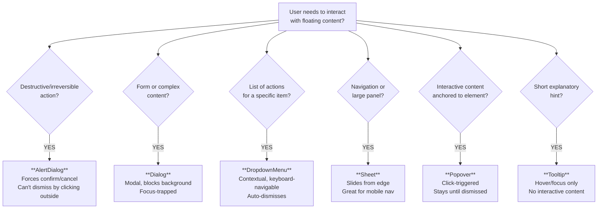

# Chapter 12: shadcn/ui — Complex Components

> Core components (Button, Input, Card) are the foundation. Now we add the *interactive* layer — dialogs for task creation, dropdown menus for actions, a command palette for power users, and a mobile sidebar. These components transform TaskFlow from "functional" to "feels like a real product."

> **📌 Where we are:** TaskFlow uses shadcn Button, Input, Card, Badge (Ch 11). Task creation still uses a plain form on the page. Actions (edit, delete) are individual buttons. There's no mobile menu. This chapter adds the UI patterns that make apps feel polished.

---

## 🧠 Concepts

### 1. Portals and Layered UI

Complex UI components like modals, dropdowns, and popovers need to render **outside** the normal DOM hierarchy. Why? Because of `overflow: hidden`, `z-index` stacking contexts, and scroll containers.

If a dropdown renders inside a card with `overflow: hidden`, it gets clipped. The solution: **portals** — rendering the overlay at the `<body>` level while keeping the React component tree intact.

Radix (which powers shadcn) handles this automatically. When you open a Dialog, its content is portaled to the document body, but React still treats it as a child of your component (for context, events, etc.).

```
React Tree:                  DOM:
<Dashboard>                  <body>
  <TaskCard>                   <div id="root">
    <Dialog>                     <Dashboard>
      <DialogContent>              <TaskCard>
        Edit task form               <!-- Dialog NOT here -->
      </DialogContent>           </Dashboard>
    </Dialog>                  </div>
  </TaskCard>                  <!-- Dialog IS here (portaled) -->
</Dashboard>                   <div role="dialog">
                                 Edit task form
                               </div>
                             </body>
```

### 2. Compound Component Pattern

shadcn components use the **compound component** pattern — multiple smaller components compose together:

```tsx
<Dialog>                          {/* Controls open/close state */}
  <DialogTrigger>                 {/* What you click to open */}
    <Button>New Task</Button>
  </DialogTrigger>
  <DialogContent>                 {/* The modal overlay + content */}
    <DialogHeader>                {/* Optional header area */}
      <DialogTitle>Create Task</DialogTitle>
      <DialogDescription>Add a new task to your board</DialogDescription>
    </DialogHeader>
    {/* Your form goes here */}
    <DialogFooter>                {/* Optional footer with actions */}
      <Button type="submit">Save</Button>
    </DialogFooter>
  </DialogContent>
</Dialog>
```

Each piece handles one concern. `DialogTrigger` handles the click. `DialogContent` handles the portal, overlay, focus trap, and escape key. You compose them like LEGO.

### 3. Controlled vs Uncontrolled Dialogs

Like form inputs, dialogs can be controlled or uncontrolled:

**Uncontrolled** — Dialog manages its own open/close state:
```tsx
<Dialog>
  <DialogTrigger>Open</DialogTrigger>
  <DialogContent>...</DialogContent>
</Dialog>
```

**Controlled** — You manage the state:
```tsx
const [open, setOpen] = useState(false);

<Dialog open={open} onOpenChange={setOpen}>
  <DialogContent>...</DialogContent>
</Dialog>

// Open programmatically:
<Button onClick={() => setOpen(true)}>New Task</Button>

// Close after form submit:
async function handleSubmit(data: TaskFormData) {
  await saveTask(data);
  setOpen(false);  // Close the dialog
}
```

Controlled mode is essential when you need to close the dialog after an action (like form submission) or open it from somewhere other than the trigger.

### 4. Accessibility Built-In

Every shadcn component inherits Radix's accessibility features:

- **Dialog:** Focus trap, `Escape` to close, `aria-labelledby`, screen reader announcements
- **DropdownMenu:** Arrow key navigation, `Enter`/`Space` to select, type-ahead search
- **AlertDialog:** Prevents accidental dismissal (no click-outside-to-close)
- **Command:** Full keyboard navigation, live search filtering
- **Tooltip:** Shows on hover AND focus, proper `aria-describedby`

You get WCAG compliance for free. No manual `aria-*` attributes, no `onKeyDown` handlers, no focus management code.

---

## 💡 Examples

### Dialog — Modal Forms

```bash
npx shadcn@latest add dialog
```

```tsx
import {
  Dialog,
  DialogContent,
  DialogDescription,
  DialogFooter,
  DialogHeader,
  DialogTitle,
  DialogTrigger,
} from "@/components/ui/dialog";
import { Button } from "@/components/ui/button";
import { Input } from "@/components/ui/input";

const CreateTaskDialog = () => {
  const [open, setOpen] = useState(false);

  async function handleSubmit(e: React.FormEvent<HTMLFormElement>) {
    e.preventDefault();
    const formData = new FormData(e.currentTarget);
    await createTask({
      title: formData.get("title") as string,
      priority: "medium",
    });
    setOpen(false);
  }

  return (
    <Dialog open={open} onOpenChange={setOpen}>
      <DialogTrigger asChild>
        <Button>+ New Task</Button>
      </DialogTrigger>
      <DialogContent className="sm:max-w-md">
        <DialogHeader>
          <DialogTitle>Create Task</DialogTitle>
          <DialogDescription>
            Add a new task to your board. Click save when you're done.
          </DialogDescription>
        </DialogHeader>
        <form onSubmit={handleSubmit} className="space-y-4">
          <div className="space-y-2">
            <label htmlFor="title" className="text-sm font-medium">
              Title
            </label>
            <Input
              id="title"
              name="title"
              placeholder="What needs to be done?"
              autoFocus
            />
          </div>
          <DialogFooter>
            <Button type="button" variant="outline" onClick={() => setOpen(false)}>
              Cancel
            </Button>
            <Button type="submit">Create</Button>
          </DialogFooter>
        </form>
      </DialogContent>
    </Dialog>
  );
}
```

### DropdownMenu — Task Actions

```bash
npx shadcn@latest add dropdown-menu
```

```tsx
import {
  DropdownMenu,
  DropdownMenuContent,
  DropdownMenuItem,
  DropdownMenuLabel,
  DropdownMenuSeparator,
  DropdownMenuTrigger,
} from "@/components/ui/dropdown-menu";
import { Button } from "@/components/ui/button";

const TaskActions = ({ task }: { task: Task }) => {
  const navigate = useNavigate();
  const { deleteTask, addTask } = useContext(TaskContext);

  function handleDuplicate() {
    addTask({
      title: `${task.title} (copy)`,
      description: task.description,
      priority: task.priority,
      status: "todo",
    });
  }

  function handleDelete() {
    // We'll replace this with AlertDialog later
    deleteTask(task.id);
  }

  return (
    <DropdownMenu>
      <DropdownMenuTrigger asChild>
        <Button variant="ghost" size="icon" className="h-8 w-8">
          <span className="sr-only">Open menu</span>
          ⋯
        </Button>
      </DropdownMenuTrigger>
      <DropdownMenuContent align="end">
        <DropdownMenuLabel>Actions</DropdownMenuLabel>
        <DropdownMenuSeparator />
        <DropdownMenuItem onClick={() => navigate(`/task/${task.id}`)}>
          👁️ View details
        </DropdownMenuItem>
        <DropdownMenuItem onClick={() => navigate(`/task/${task.id}/edit`)}>
          ✏️ Edit
        </DropdownMenuItem>
        <DropdownMenuItem onClick={handleDuplicate}>
          📋 Duplicate
        </DropdownMenuItem>
        <DropdownMenuSeparator />
        <DropdownMenuItem
          onClick={handleDelete}
          className="text-red-600 focus:text-red-600"
        >
          🗑️ Delete
        </DropdownMenuItem>
      </DropdownMenuContent>
    </DropdownMenu>
  );
}
```

### Command — Cmd+K Search Palette

```bash
npx shadcn@latest add command
```

The Command component is based on `cmdk` — a fast, accessible command palette library.

```tsx
import {
  CommandDialog,
  CommandEmpty,
  CommandGroup,
  CommandInput,
  CommandItem,
  CommandList,
  CommandSeparator,
} from "@/components/ui/command";

const CommandPalette = () => {
  const [open, setOpen] = useState(false);
  const { tasks } = useContext(TaskContext);
  const navigate = useNavigate();

  // Register Cmd+K / Ctrl+K shortcut
  useEffect(() => {
    function handleKeyDown(e: KeyboardEvent) {
      if ((e.metaKey || e.ctrlKey) && e.key === "k") {
        e.preventDefault();
        setOpen((prev) => !prev);
      }
    }
    document.addEventListener("keydown", handleKeyDown);
    return () => document.removeEventListener("keydown", handleKeyDown);
  }, []);

  function handleSelect(taskId: string) {
    navigate(`/task/${taskId}`);
    setOpen(false);
  }

  return (
    <CommandDialog open={open} onOpenChange={setOpen}>
      <CommandInput placeholder="Search tasks..." />
      <CommandList>
        <CommandEmpty>No tasks found.</CommandEmpty>

        <CommandGroup heading="Tasks">
          {tasks.map((task) => (
            <CommandItem
              key={task.id}
              value={task.title}
              onSelect={() => handleSelect(task.id)}
            >
              <span className="mr-2">
                {task.status === "done" ? "✅" : "📋"}
              </span>
              <span>{task.title}</span>
              <span className="ml-auto text-xs text-muted-foreground">
                {task.priority}
              </span>
            </CommandItem>
          ))}
        </CommandGroup>

        <CommandSeparator />

        <CommandGroup heading="Navigation">
          <CommandItem onSelect={() => { navigate("/"); setOpen(false); }}>
            📊 Dashboard
          </CommandItem>
          <CommandItem onSelect={() => { navigate("/settings"); setOpen(false); }}>
            ⚙️ Settings
          </CommandItem>
        </CommandGroup>
      </CommandList>
    </CommandDialog>
  );
}
```

### Sheet — Mobile Sidebar

```bash
npx shadcn@latest add sheet
```

```tsx
import {
  Sheet,
  SheetContent,
  SheetHeader,
  SheetTitle,
  SheetTrigger,
} from "@/components/ui/sheet";
import { Button } from "@/components/ui/button";
import { NavLink } from "react-router-dom";

const MobileSidebar = () => {
  const [open, setOpen] = useState(false);

  return (
    <Sheet open={open} onOpenChange={setOpen}>
      <SheetTrigger asChild>
        <Button variant="ghost" size="icon" className="md:hidden">
          ☰
        </Button>
      </SheetTrigger>
      <SheetContent side="left" className="w-64">
        <SheetHeader>
          <SheetTitle>📋 TaskFlow</SheetTitle>
        </SheetHeader>
        <nav className="mt-6 flex flex-col gap-1">
          <NavLink
            to="/"
            end
            onClick={() => setOpen(false)}
            className={({ isActive }) =>
              `rounded-lg px-3 py-2 text-sm font-medium transition-colors ${
                isActive
                  ? "bg-accent text-accent-foreground"
                  : "text-muted-foreground hover:bg-accent hover:text-accent-foreground"
              }`
            }
          >
            📊 Dashboard
          </NavLink>
          <NavLink
            to="/settings"
            onClick={() => setOpen(false)}
            className={({ isActive }) =>
              `rounded-lg px-3 py-2 text-sm font-medium transition-colors ${
                isActive
                  ? "bg-accent text-accent-foreground"
                  : "text-muted-foreground hover:bg-accent hover:text-accent-foreground"
              }`
            }
          >
            ⚙️ Settings
          </NavLink>
        </nav>
      </SheetContent>
    </Sheet>
  );
}
```

### AlertDialog — Confirmation Before Delete

```bash
npx shadcn@latest add alert-dialog
```

```tsx
import {
  AlertDialog,
  AlertDialogAction,
  AlertDialogCancel,
  AlertDialogContent,
  AlertDialogDescription,
  AlertDialogFooter,
  AlertDialogHeader,
  AlertDialogTitle,
  AlertDialogTrigger,
} from "@/components/ui/alert-dialog";

const DeleteTaskButton = ({ taskId, taskTitle }: {
  taskId: string;
  taskTitle: string;
}) {
  const { deleteTask } = useContext(TaskContext);
  const navigate = useNavigate();

  function handleDelete() {
    deleteTask(taskId);
    navigate("/");
  }

  return (
    <AlertDialog>
      <AlertDialogTrigger asChild>
        <Button variant="destructive">Delete Task</Button>
      </AlertDialogTrigger>
      <AlertDialogContent>
        <AlertDialogHeader>
          <AlertDialogTitle>Are you sure?</AlertDialogTitle>
          <AlertDialogDescription>
            This will permanently delete "{taskTitle}". This action cannot
            be undone.
          </AlertDialogDescription>
        </AlertDialogHeader>
        <AlertDialogFooter>
          <AlertDialogCancel>Cancel</AlertDialogCancel>
          <AlertDialogAction
            onClick={handleDelete}
            className="bg-red-600 hover:bg-red-700"
          >
            Delete
          </AlertDialogAction>
        </AlertDialogFooter>
      </AlertDialogContent>
    </AlertDialog>
  );
}
```

> **AlertDialog vs Dialog:** `AlertDialog` **cannot** be closed by clicking outside or pressing `Escape` — it requires an explicit button click. Use it when you need to prevent accidental dismissal (destructive actions, unsaved changes).

### Popover — Quick Task Preview

```bash
npx shadcn@latest add popover
```

```tsx
import {
  Popover,
  PopoverContent,
  PopoverTrigger,
} from "@/components/ui/popover";
import { Badge } from "@/components/ui/badge";

const TaskPreview = ({ task }: { task: Task }) => {
  return (
    <Popover>
      <PopoverTrigger asChild>
        <button className="text-left hover:underline">
          {task.title}
        </button>
      </PopoverTrigger>
      <PopoverContent className="w-80">
        <div className="space-y-3">
          <div className="flex items-center justify-between">
            <h4 className="font-semibold">{task.title}</h4>
            <Badge variant={task.priority}>{task.priority}</Badge>
          </div>
          {task.description && (
            <p className="text-sm text-muted-foreground">
              {task.description}
            </p>
          )}
          <div className="flex items-center justify-between text-xs text-muted-foreground">
            <span>Status: {task.status}</span>
            <span>Created: {new Date(task.createdAt).toLocaleDateString()}</span>
          </div>
        </div>
      </PopoverContent>
    </Popover>
  );
}
```

### Tooltip — Helpful Hints

```bash
npx shadcn@latest add tooltip
```

```tsx
import {
  Tooltip,
  TooltipContent,
  TooltipProvider,
  TooltipTrigger,
} from "@/components/ui/tooltip";

// Wrap your app (or layout) in TooltipProvider once:
<TooltipProvider>
  <App />
</TooltipProvider>

// Then use tooltips anywhere:
<Tooltip>
  <TooltipTrigger asChild>
    <Button variant="ghost" size="icon">
      ⌨️
    </Button>
  </TooltipTrigger>
  <TooltipContent>
    <p>Press Cmd+K to search</p>
  </TooltipContent>
</Tooltip>
```

---

## 🤔 Choosing the Right Overlay Component

You've just learned six different overlay components: Dialog, AlertDialog, DropdownMenu, Sheet, Popover, and Tooltip. They all float above the page. So how do you pick the right one?

Here's a decision tree:



### Real-World Examples

Think about apps you use every day — they've already solved these decisions:

- **Instagram:** Sheet for comments panel (slides up from bottom), Dialog for post creation (complex form), AlertDialog for "Delete account?" (irreversible)
- **GitHub:** DropdownMenu for the "..." actions on a PR, Popover for the branch selector (interactive search), Tooltip for icon buttons ("Copy SHA")
- **Slack:** Dialog for message editing, Sheet for thread panel, DropdownMenu for message actions, Tooltip for reaction emoji names
- **VS Code:** Command Palette (Command — which is basically a Dialog + search), context menus (DropdownMenu), hover info (Tooltip)

### The Key Distinctions

**Dialog vs Sheet:** Both are large overlays. Dialog is centered and feels like an interruption ("stop and deal with this"). Sheet slides in from the side and feels like an extension of the page ("here's more detail"). On mobile, Sheets work better for navigation because they feel natural — users are trained to swipe panels.

**Dialog vs AlertDialog:** AlertDialog is a *subset* of Dialog with one critical difference: it **cannot be dismissed by clicking outside or pressing Escape**. The user MUST click one of the action buttons. This is intentional — you don't want someone accidentally closing a "Delete all data?" confirmation by tapping the background.

**Popover vs Tooltip:** Popovers are triggered by click and can contain interactive content (buttons, links, forms). Tooltips are triggered by hover/focus and should only contain plain text. If users need to *interact* with the floating content, it's a Popover. If they just need to *read* it, it's a Tooltip.

**Popover vs Dialog:** Popovers are *anchored* to a trigger element and non-modal (the background is still interactive). Dialogs are *centered* and modal (background is blocked). Use Popover for contextual info related to a specific element. Use Dialog when the task requires full attention.

**DropdownMenu vs Popover:** Both are click-triggered and anchored. DropdownMenu is specifically for a *list of actions* — it has built-in keyboard navigation (arrow keys), type-ahead search, and auto-dismisses after selection. Popover is for arbitrary content. If it's a menu, use DropdownMenu.

### Common Mistakes

1. **Using Dialog when you need AlertDialog** — "Are you sure you want to delete?" should be AlertDialog. Users WILL accidentally click outside and lose the confirmation.

2. **Using Tooltip for important information** — Tooltips are invisible on touch devices (no hover). If the info matters, use a Popover or just show it inline.

3. **Using Dialog for everything** — Not every interaction needs a modal. Quick actions belong in DropdownMenus. Simple settings belong in Popovers. Reserve Dialog for complex, multi-field interactions.

4. **Nesting modals** — Opening a Dialog from inside a Dialog is almost always a UX smell. If you need to confirm an action inside a Dialog, use AlertDialog (it's designed for this). Otherwise, redesign the flow.

---

## 🔨 Project Task: Make TaskFlow Interactive

### Step 1: Install All Components

```bash
npx shadcn@latest add dialog dropdown-menu command sheet alert-dialog popover tooltip
```

### Step 2: Add the Task Creation Dialog

Replace the QuickAdd form with a proper dialog that includes the full TaskForm:

**`src/components/CreateTaskDialog.tsx`**
```tsx
import { useState, useContext } from "react";
import {
  Dialog,
  DialogContent,
  DialogDescription,
  DialogHeader,
  DialogTitle,
  DialogTrigger,
} from "@/components/ui/dialog";
import { Button } from "@/components/ui/button";
import TaskForm from "./TaskForm";
import { TaskContext } from "@/context/TaskContext";
import type { TaskFormData } from "@/schemas/task";

const CreateTaskDialog = () => {
  const [open, setOpen] = useState(false);
  const { addTask } = useContext(TaskContext);

  async function handleCreate(data: TaskFormData) {
    addTask({
      ...data,
      status: data.status ?? "todo",
    });
    setOpen(false);
  }

  return (
    <Dialog open={open} onOpenChange={setOpen}>
      <DialogTrigger asChild>
        <Button>+ New Task</Button>
      </DialogTrigger>
      <DialogContent className="sm:max-w-lg">
        <DialogHeader>
          <DialogTitle>Create New Task</DialogTitle>
          <DialogDescription>
            Fill in the details below. Click save when you're done.
          </DialogDescription>
        </DialogHeader>
        <TaskForm onSubmit={handleCreate} submitLabel="Create Task" />
      </DialogContent>
    </Dialog>
  );
}
```

### Step 3: Add Action Dropdown to Task Cards

Update `TaskCard` to include the dropdown:

**`src/components/TaskCard.tsx`** (updated)
```tsx
import { useContext } from "react";
import { Link, useNavigate } from "react-router-dom";
import { Card, CardContent } from "@/components/ui/card";
import { Badge } from "@/components/ui/badge";
import { Button } from "@/components/ui/button";
import {
  DropdownMenu,
  DropdownMenuContent,
  DropdownMenuItem,
  DropdownMenuSeparator,
  DropdownMenuTrigger,
} from "@/components/ui/dropdown-menu";
import {
  AlertDialog,
  AlertDialogAction,
  AlertDialogCancel,
  AlertDialogContent,
  AlertDialogDescription,
  AlertDialogFooter,
  AlertDialogHeader,
  AlertDialogTitle,
  AlertDialogTrigger,
} from "@/components/ui/alert-dialog";
import { cn } from "@/lib/utils";
import { TaskContext } from "@/context/TaskContext";
import type { Task } from "@/types/task";

interface TaskCardProps {
  task: Task;
  className?: string;
}

const TaskCard = ({ task, className }: TaskCardProps) => {
  const navigate = useNavigate();
  const { deleteTask, addTask } = useContext(TaskContext);

  function handleDuplicate() {
    addTask({
      title: `${task.title} (copy)`,
      description: task.description,
      priority: task.priority,
      status: "todo",
    });
  }

  return (
    <Card
      className={cn(
        "transition-all duration-200 hover:shadow-md",
        className
      )}
    >
      <CardContent className="flex items-center justify-between p-4">
        {/* Clickable area → navigates to detail */}
        <Link
          to={`/task/${task.id}`}
          className="flex-1 space-y-1"
        >
          <p className="font-medium leading-none hover:underline">
            {task.title}
          </p>
          {task.description && (
            <p className="text-sm text-muted-foreground line-clamp-1">
              {task.description}
            </p>
          )}
        </Link>

        {/* Badges + actions */}
        <div className="flex items-center gap-2 ml-4">
          <Badge variant={task.priority}>{task.priority}</Badge>

          {/* Action dropdown */}
          <DropdownMenu>
            <DropdownMenuTrigger asChild>
              <Button variant="ghost" size="icon" className="h-8 w-8">
                <span className="sr-only">Open menu</span>
                ⋯
              </Button>
            </DropdownMenuTrigger>
            <DropdownMenuContent align="end">
              <DropdownMenuItem onClick={() => navigate(`/task/${task.id}`)}>
                👁️ View
              </DropdownMenuItem>
              <DropdownMenuItem
                onClick={() => navigate(`/task/${task.id}/edit`)}
              >
                ✏️ Edit
              </DropdownMenuItem>
              <DropdownMenuItem onClick={handleDuplicate}>
                📋 Duplicate
              </DropdownMenuItem>
              <DropdownMenuSeparator />

              {/* Delete with confirmation */}
              <AlertDialog>
                <AlertDialogTrigger asChild>
                  <DropdownMenuItem
                    onSelect={(e) => e.preventDefault()}
                    className="text-red-600 focus:text-red-600"
                  >
                    🗑️ Delete
                  </DropdownMenuItem>
                </AlertDialogTrigger>
                <AlertDialogContent>
                  <AlertDialogHeader>
                    <AlertDialogTitle>Delete task?</AlertDialogTitle>
                    <AlertDialogDescription>
                      This will permanently delete "{task.title}". You can't
                      undo this.
                    </AlertDialogDescription>
                  </AlertDialogHeader>
                  <AlertDialogFooter>
                    <AlertDialogCancel>Cancel</AlertDialogCancel>
                    <AlertDialogAction
                      onClick={() => deleteTask(task.id)}
                      className="bg-red-600 hover:bg-red-700"
                    >
                      Delete
                    </AlertDialogAction>
                  </AlertDialogFooter>
                </AlertDialogContent>
              </AlertDialog>
            </DropdownMenuContent>
          </DropdownMenu>
        </div>
      </CardContent>
    </Card>
  );
}
```

> **Note:** `onSelect={(e) => e.preventDefault()}` on the delete DropdownMenuItem prevents the dropdown from closing before the AlertDialog opens. This is a common pattern when nesting dialogs inside dropdowns.

### Step 4: Add the Command Palette

**`src/components/CommandPalette.tsx`**
```tsx
import { useState, useEffect, useContext } from "react";
import { useNavigate } from "react-router-dom";
import {
  CommandDialog,
  CommandEmpty,
  CommandGroup,
  CommandInput,
  CommandItem,
  CommandList,
  CommandSeparator,
} from "@/components/ui/command";
import { TaskContext } from "@/context/TaskContext";

const CommandPalette = () => {
  const [open, setOpen] = useState(false);
  const { tasks } = useContext(TaskContext);
  const navigate = useNavigate();

  useEffect(() => {
    function handleKeyDown(e: KeyboardEvent) {
      if ((e.metaKey || e.ctrlKey) && e.key === "k") {
        e.preventDefault();
        setOpen((prev) => !prev);
      }
    }
    document.addEventListener("keydown", handleKeyDown);
    return () => document.removeEventListener("keydown", handleKeyDown);
  }, []);

  function go(path: string) {
    navigate(path);
    setOpen(false);
  }

  return (
    <CommandDialog open={open} onOpenChange={setOpen}>
      <CommandInput placeholder="Type to search tasks and pages..." />
      <CommandList>
        <CommandEmpty>No results found.</CommandEmpty>

        <CommandGroup heading="Tasks">
          {tasks.map((task) => (
            <CommandItem
              key={task.id}
              value={task.title}
              onSelect={() => go(`/task/${task.id}`)}
              className="cursor-pointer"
            >
              <span className="mr-2">
                {task.status === "done"
                  ? "✅"
                  : task.priority === "high"
                  ? "🔴"
                  : "📋"}
              </span>
              <span className="flex-1">{task.title}</span>
              <span className="text-xs text-muted-foreground">
                {task.status}
              </span>
            </CommandItem>
          ))}
        </CommandGroup>

        <CommandSeparator />

        <CommandGroup heading="Pages">
          <CommandItem onSelect={() => go("/")} className="cursor-pointer">
            📊 Dashboard
          </CommandItem>
          <CommandItem onSelect={() => go("/settings")} className="cursor-pointer">
            ⚙️ Settings
          </CommandItem>
        </CommandGroup>

        <CommandSeparator />

        <CommandGroup heading="Actions">
          <CommandItem
            onSelect={() => {
              setOpen(false);
              // Trigger create task dialog — you'd need shared state or a callback
              document.dispatchEvent(new CustomEvent("create-task"));
            }}
            className="cursor-pointer"
          >
            ➕ Create new task
          </CommandItem>
        </CommandGroup>
      </CommandList>
    </CommandDialog>
  );
}
```

### Step 5: Add the Mobile Sidebar

**`src/components/MobileSidebar.tsx`**
```tsx
import { useState } from "react";
import { NavLink } from "react-router-dom";
import {
  Sheet,
  SheetContent,
  SheetHeader,
  SheetTitle,
  SheetTrigger,
} from "@/components/ui/sheet";
import { Button } from "@/components/ui/button";
import ThemeToggle from "./ThemeToggle";

const MobileSidebar = () => {
  const [open, setOpen] = useState(false);

  const linkClass = ({ isActive }: { isActive: boolean }) =>
    `flex items-center gap-2 rounded-lg px-3 py-2 text-sm font-medium transition-colors ${
      isActive
        ? "bg-accent text-accent-foreground"
        : "text-muted-foreground hover:bg-accent hover:text-accent-foreground"
    }`;

  return (
    <Sheet open={open} onOpenChange={setOpen}>
      <SheetTrigger asChild>
        <Button variant="ghost" size="icon" className="md:hidden">
          <span className="text-xl">☰</span>
          <span className="sr-only">Toggle menu</span>
        </Button>
      </SheetTrigger>
      <SheetContent side="left" className="w-64">
        <SheetHeader>
          <SheetTitle className="text-left">📋 TaskFlow</SheetTitle>
        </SheetHeader>
        <nav className="mt-6 flex flex-col gap-1">
          <NavLink to="/" end onClick={() => setOpen(false)} className={linkClass}>
            📊 Dashboard
          </NavLink>
          <NavLink to="/settings" onClick={() => setOpen(false)} className={linkClass}>
            ⚙️ Settings
          </NavLink>
        </nav>
        <div className="mt-auto flex items-center justify-between border-t pt-4">
          <span className="text-xs text-muted-foreground">Theme</span>
          <ThemeToggle />
        </div>
      </SheetContent>
    </Sheet>
  );
}
```

### Step 6: Update the Layout

Wire everything into the Layout:

**`src/components/Layout.tsx`** (final version)
```tsx
import { Outlet, NavLink } from "react-router-dom";
import {
  Tooltip,
  TooltipContent,
  TooltipProvider,
  TooltipTrigger,
} from "@/components/ui/tooltip";
import { Button } from "@/components/ui/button";
import ThemeToggle from "./ThemeToggle";
import MobileSidebar from "./MobileSidebar";
import CommandPalette from "./CommandPalette";
import CreateTaskDialog from "./CreateTaskDialog";

const navLinkClass = ({ isActive }: { isActive: boolean }) =>
  `flex items-center gap-2 rounded-lg px-3 py-2 text-sm font-medium transition-colors ${
    isActive
      ? "bg-accent text-accent-foreground"
      : "text-muted-foreground hover:bg-accent hover:text-accent-foreground"
  }`;

const Layout = () => {
  return (
    <TooltipProvider>
      <div className="flex h-screen bg-background">
        {/* Desktop Sidebar */}
        <aside className="hidden w-64 flex-col border-r bg-card p-4 md:flex">
          <div className="mb-6">
            <h1 className="text-xl font-bold">📋 TaskFlow</h1>
          </div>

          <nav className="flex flex-col gap-1">
            <NavLink to="/" end className={navLinkClass}>
              📊 Dashboard
            </NavLink>
            <NavLink to="/settings" className={navLinkClass}>
              ⚙️ Settings
            </NavLink>
          </nav>

          <div className="mt-4">
            <CreateTaskDialog />
          </div>

          <div className="mt-auto flex items-center justify-between border-t pt-4">
            <Tooltip>
              <TooltipTrigger asChild>
                <Button variant="ghost" size="sm" className="text-xs text-muted-foreground">
                  ⌨️ Cmd+K
                </Button>
              </TooltipTrigger>
              <TooltipContent>
                <p>Search tasks and navigate</p>
              </TooltipContent>
            </Tooltip>
            <ThemeToggle />
          </div>
        </aside>

        {/* Main area */}
        <div className="flex flex-1 flex-col">
          {/* Mobile header */}
          <header className="flex items-center justify-between border-b bg-card p-4 md:hidden">
            <MobileSidebar />
            <h1 className="text-lg font-bold">📋 TaskFlow</h1>
            <ThemeToggle />
          </header>

          {/* Content */}
          <main className="flex-1 overflow-y-auto p-4 md:p-8">
            <Outlet />
          </main>
        </div>

        {/* Command palette (renders as portal, position doesn't matter) */}
        <CommandPalette />
      </div>
    </TooltipProvider>
  );
}
```

### Step 7: Verify

- [ ] **Dialog:** Click "+ New Task" → dialog opens, create a task, dialog closes
- [ ] **Dropdown:** Click the ⋯ menu on a task → View, Edit, Duplicate, Delete
- [ ] **AlertDialog:** Click Delete → confirmation dialog, cancel returns to list
- [ ] **Command palette:** Press `Cmd+K` (or `Ctrl+K`) → search palette appears
  - Type a task name → it filters
  - Select a task → navigates to detail page
  - Select a page → navigates there
- [ ] **Sheet:** On mobile, tap ☰ → sidebar slides in from left
  - Click a nav link → navigates and sidebar closes
- [ ] **Tooltips:** Hover the "Cmd+K" text → tooltip shows
- [ ] **Keyboard accessibility:** Tab through the dropdown items, press Enter to select
- [ ] **Escape key:** Close any open dialog/dropdown/palette with Escape
- [ ] **Dark mode:** All overlay components respect the current theme

---

## 🧪 Challenge

1. **Task status quick-toggle:** Add a DropdownMenu sub-menu for changing task status directly from the card:
   ```tsx
   <DropdownMenuSub>
     <DropdownMenuSubTrigger>Change status</DropdownMenuSubTrigger>
     <DropdownMenuSubContent>
       <DropdownMenuItem>To Do</DropdownMenuItem>
       <DropdownMenuItem>In Progress</DropdownMenuItem>
       <DropdownMenuItem>Done</DropdownMenuItem>
     </DropdownMenuSubContent>
   </DropdownMenuSub>
   ```

2. **Recent tasks in Command palette:** Add a "Recent" group to the command palette that shows the 3 most recently viewed tasks (track views in state or localStorage).

3. **Keyboard shortcut indicator:** Show keyboard shortcuts in the DropdownMenu items:
   ```tsx
   <DropdownMenuItem>
     Edit
     <DropdownMenuShortcut>⌘E</DropdownMenuShortcut>
   </DropdownMenuItem>
   ```
   Then actually wire up the global shortcuts.

4. **Toast notifications:** Install the `sonner` toast library (works great with shadcn) and show a toast when tasks are created, deleted, or duplicated:
   ```bash
   npx shadcn@latest add sonner
   ```

---

## 📚 Further Reading

- [shadcn/ui Components](https://ui.shadcn.com/docs/components) — full list with examples
- [Radix Primitives](https://www.radix-ui.com/primitives) — the headless components underneath
- [cmdk](https://cmdk.paco.me/) — the command palette library
- [React Portals](https://react.dev/reference/react-dom/createPortal) — how portals work
- [WAI-ARIA Dialog Pattern](https://www.w3.org/WAI/ARIA/apd/patterns/dialog-modal/) — the accessibility spec for modals
- [Vercel: Preloading on intent](https://vercel.com/blog) — preload dialog content on hover for instant open

---

**Next up: [Chapter 13 — Data Display →](/chapters/13-data-display)**

Tables, lists, sorting, filtering, and pagination — all the patterns for displaying collections of data beautifully.
