# Chapter 14: Forms the shadcn Way

> In Chapter 8, you learned React Hook Form and Zod. In Chapters 11-12, you learned shadcn components. Now we combine them. shadcn's `<Form>` component wraps React Hook Form with accessible, styled primitives — labels auto-link to inputs, errors appear in the right place, and you write half the code.

> **📌 Where we are:** TaskFlow has a DataTable (Ch 13), shadcn UI throughout (Ch 11-12), and React Hook Form with Zod validation (Ch 8). The form *works*, but it's not using shadcn's form components yet. This chapter fixes that and adds richer fields (date pickers, comboboxes, selects).

---

## 🧠 Concepts

### 1. The shadcn Form Stack

```mermaid
%%{init: {'theme':'default'}}%%
block-beta
  columns 1
  block:form["shadcn Form — styled, accessible UI"]
    block:rhf["React Hook Form — form state management"]
      zod["Zod — schema validation"]
    end
    components["FormField → FormItem → FormLabel<br/>FormControl → FormDescription<br/>FormMessage (auto error display)"]
  end
```

shadcn's `<Form>` component isn't just a styled `<form>`. It's an orchestration layer that connects three powerful libraries:



**Why this stack?**
- **Zod** defines the shape and rules of your data (schemas)
- **React Hook Form** manages form state (values, dirty, touched) without re-rendering on every keystroke
- **shadcn Form** provides accessible, styled wrappers that automatically connect labels, descriptions, and error messages to the right inputs

Together, you get type-safe, performant, accessible forms with minimal code.

### 2. The Form Component Hierarchy

Every shadcn form follows this nesting pattern:

```tsx
<Form>                          {/* provides React Hook Form context */}
  <form>                        {/* native <form> element */}
    <FormField                  {/* connects to a specific field in your schema */}
      control={form.control}
      name="title"
      render={({ field }) => (
        <FormItem>              {/* wrapper: groups label + input + message */}
          <FormLabel>           {/* <label> with htmlFor auto-connected */}
          <FormControl>         {/* passes aria attributes to child input */}
            <Input {...field} />
          </FormControl>
          <FormDescription>    {/* helper text below input */}
          <FormMessage />       {/* validation error — auto-displayed! */}
        </FormItem>
      )}
    />
  </form>
</Form>
```

Each piece has a job:

| Component | What It Does |
|-----------|-------------|
| `<Form>` | Wraps the form, provides React Hook Form context via `FormProvider` |
| `<FormField>` | Connects a specific field from your schema, passes `field` props (value, onChange, onBlur, ref) |
| `<FormItem>` | Groups the label, control, description, and message together; generates a unique ID |
| `<FormLabel>` | Renders a `<label>` auto-linked to the input (no manual `htmlFor`) |
| `<FormControl>` | Wraps the actual input, injects `aria-describedby` and `aria-invalid` |
| `<FormDescription>` | Optional helper text, linked via `aria-describedby` |
| `<FormMessage>` | Shows the Zod validation error for this field — no manual error handling! |

The magic: `<FormMessage />` is *empty* until validation fails, then it *automatically* shows the Zod error for that field. No conditional rendering, no error state management.

### 3. Zod + React Hook Form Integration

The `zodResolver` bridges Zod schemas and React Hook Form:

```tsx
import { useForm } from "react-hook-form";
import { zodResolver } from "@hookform/resolvers/zod";
import { z } from "zod";

const taskSchema = z.object({
  title: z.string().min(1, "Title is required").max(100, "Too long"),
  description: z.string().optional(),
  priority: z.enum(["low", "medium", "high"]),
  status: z.enum(["todo", "in-progress", "done"]),
  dueDate: z.date().optional(),
  assignee: z.string().optional(),
  category: z.string().min(1, "Category is required"),
});

// Infer the TypeScript type from the schema — single source of truth!
type TaskFormValues = z.infer<typeof taskSchema>;

const TaskForm = () => {
  const form = useForm<TaskFormValues>({
    resolver: zodResolver(taskSchema),
    defaultValues: {
      title: "",
      description: "",
      priority: "medium",
      status: "todo",
      category: "",
    },
  });

  function onSubmit(values: TaskFormValues) {
    // `values` is fully validated and typed!
    console.log(values);
  }

  return (
    <Form {...form}>
      <form onSubmit={form.handleSubmit(onSubmit)}>
        {/* fields go here */}
      </form>
    </Form>
  );
}
```

**The beauty:** `z.infer<typeof taskSchema>` generates your TypeScript type from the Zod schema. One schema = validation rules + TypeScript type. Change it in one place, everything updates.

### 4. Rich Input Components

shadcn provides specialized input components that work seamlessly with `<FormField>`:

#### Select — for enums (priority, category, status)

```tsx
<FormField
  control={form.control}
  name="priority"
  render={({ field }) => (
    <FormItem>
      <FormLabel>Priority</FormLabel>
      <Select onValueChange={field.onChange} defaultValue={field.value}>
        <FormControl>
          <SelectTrigger>
            <SelectValue placeholder="Select priority" />
          </SelectTrigger>
        </FormControl>
        <SelectContent>
          <SelectItem value="low">Low</SelectItem>
          <SelectItem value="medium">Medium</SelectItem>
          <SelectItem value="high">High</SelectItem>
        </SelectContent>
      </Select>
      <FormMessage />
    </FormItem>
  )}
/>
```

**Notice:** Select uses `onValueChange` instead of `onChange` (it passes the value directly, not an event). The `<FormControl>` wraps the `<SelectTrigger>`, not the whole `<Select>`.

#### DatePicker — Calendar + Popover

```tsx
import { Calendar } from "@/components/ui/calendar";
import { Popover, PopoverContent, PopoverTrigger } from "@/components/ui/popover";
import { CalendarIcon } from "lucide-react";
import { format } from "date-fns";

<FormField
  control={form.control}
  name="dueDate"
  render={({ field }) => (
    <FormItem className="flex flex-col">
      <FormLabel>Due Date</FormLabel>
      <Popover>
        <PopoverTrigger asChild>
          <FormControl>
            <Button
              variant="outline"
              className={cn(
                "w-[240px] pl-3 text-left font-normal",
                !field.value && "text-muted-foreground"
              )}
            >
              {field.value ? format(field.value, "PPP") : "Pick a date"}
              <CalendarIcon className="ml-auto h-4 w-4 opacity-50" />
            </Button>
          </FormControl>
        </PopoverTrigger>
        <PopoverContent className="w-auto p-0" align="start">
          <Calendar
            mode="single"
            selected={field.value}
            onSelect={field.onChange}
            disabled={(date) => date < new Date()}
            initialFocus
          />
        </PopoverContent>
      </Popover>
      <FormDescription>When is this task due?</FormDescription>
      <FormMessage />
    </FormItem>
  )}
/>
```

The DatePicker is a composition of `<Popover>` + `<Calendar>` — not a single component. This gives you full control over how it looks and behaves.

#### Combobox — searchable select (assignee)

```tsx
import { Popover, PopoverContent, PopoverTrigger } from "@/components/ui/popover";
import {
  Command,
  CommandEmpty,
  CommandGroup,
  CommandInput,
  CommandItem,
  CommandList,
} from "@/components/ui/command";
import { Check, ChevronsUpDown } from "lucide-react";

const teamMembers = [
  { value: "alice", label: "Alice Johnson" },
  { value: "bob", label: "Bob Smith" },
  { value: "carol", label: "Carol Williams" },
];

<FormField
  control={form.control}
  name="assignee"
  render={({ field }) => (
    <FormItem className="flex flex-col">
      <FormLabel>Assignee</FormLabel>
      <Popover>
        <PopoverTrigger asChild>
          <FormControl>
            <Button
              variant="outline"
              role="combobox"
              className={cn(
                "w-[240px] justify-between",
                !field.value && "text-muted-foreground"
              )}
            >
              {field.value
                ? teamMembers.find((m) => m.value === field.value)?.label
                : "Select assignee"}
              <ChevronsUpDown className="ml-2 h-4 w-4 shrink-0 opacity-50" />
            </Button>
          </FormControl>
        </PopoverTrigger>
        <PopoverContent className="w-[240px] p-0">
          <Command>
            <CommandInput placeholder="Search team members..." />
            <CommandList>
              <CommandEmpty>No member found.</CommandEmpty>
              <CommandGroup>
                {teamMembers.map((member) => (
                  <CommandItem
                    key={member.value}
                    value={member.value}
                    onSelect={() => {
                      form.setValue("assignee", member.value);
                    }}
                  >
                    <Check
                      className={cn(
                        "mr-2 h-4 w-4",
                        member.value === field.value ? "opacity-100" : "opacity-0"
                      )}
                    />
                    {member.label}
                  </CommandItem>
                ))}
              </CommandGroup>
            </CommandList>
          </Command>
        </PopoverContent>
      </Popover>
      <FormDescription>Who should work on this?</FormDescription>
      <FormMessage />
    </FormItem>
  )}
/>
```

The Combobox is a `<Popover>` + `<Command>` (which is powered by cmdk). Users can type to search through options — essential when the list gets long.

#### Textarea, Switch, Checkbox

```tsx
// Textarea for descriptions
<FormField
  control={form.control}
  name="description"
  render={({ field }) => (
    <FormItem>
      <FormLabel>Description</FormLabel>
      <FormControl>
        <Textarea
          placeholder="Describe the task..."
          className="resize-none"
          {...field}
        />
      </FormControl>
      <FormDescription>Optional details about this task.</FormDescription>
      <FormMessage />
    </FormItem>
  )}
/>

// Switch for boolean toggles
<FormField
  control={form.control}
  name="isUrgent"
  render={({ field }) => (
    <FormItem className="flex flex-row items-center justify-between rounded-lg border p-4">
      <div className="space-y-0.5">
        <FormLabel className="text-base">Urgent</FormLabel>
        <FormDescription>Mark this task as time-sensitive.</FormDescription>
      </div>
      <FormControl>
        <Switch checked={field.value} onCheckedChange={field.onChange} />
      </FormControl>
    </FormItem>
  )}
/>

// Checkbox for multi-select (tags/labels)
<FormField
  control={form.control}
  name="tags"
  render={() => (
    <FormItem>
      <FormLabel>Tags</FormLabel>
      {availableTags.map((tag) => (
        <FormField
          key={tag.id}
          control={form.control}
          name="tags"
          render={({ field }) => (
            <FormItem className="flex flex-row items-start space-x-3 space-y-0">
              <FormControl>
                <Checkbox
                  checked={field.value?.includes(tag.id)}
                  onCheckedChange={(checked) => {
                    return checked
                      ? field.onChange([...field.value, tag.id])
                      : field.onChange(field.value?.filter((v: string) => v !== tag.id));
                  }}
                />
              </FormControl>
              <FormLabel className="font-normal">{tag.label}</FormLabel>
            </FormItem>
          )}
        />
      ))}
      <FormMessage />
    </FormItem>
  )}
/>
```

### 5. Accessibility: It's Built In

This is the unsung hero of shadcn forms. All of this happens *automatically*:

- **Labels are linked to inputs** via auto-generated IDs (`htmlFor` / `id`)
- **Error messages are announced** to screen readers via `aria-describedby`
- **Invalid fields are marked** with `aria-invalid="true"`
- **Helper text is associated** via `aria-describedby` alongside error messages
- **Focus management** — invalid fields are focused after failed submission

You don't need to wire any of this up. `<FormControl>` injects the right ARIA attributes, `<FormMessage>` gets linked automatically. This is why using the shadcn Form pattern matters — accessibility isn't an afterthought.

### 6. 🆕 React 19: useActionState with shadcn Forms

React 19 introduced `useActionState` for server-side form handling. But what if you're using React Hook Form on the client? You can combine both:

```tsx
import { useActionState } from "react";
import { useForm } from "react-hook-form";

const TaskForm = () => {
  const form = useForm<TaskFormValues>({
    resolver: zodResolver(taskSchema),
    defaultValues: { title: "", priority: "medium" },
  });

  // useActionState for async server submission
  const [serverError, submitAction, isPending] = useActionState(
    async (_prev: string | null, formData: FormData) => {
      // This could be a server action or API call
      const result = await saveTaskToServer(Object.fromEntries(formData));
      if (result.error) return result.error;
      toast.success("Task saved!");
      return null;
    },
    null
  );

  // Client-side validation with React Hook Form,
  // then submit via useActionState
  const onSubmit = (values: TaskFormValues) => {
    const formData = new FormData();
    Object.entries(values).forEach(([key, value]) => {
      if (value !== undefined) formData.append(key, String(value));
    });
    submitAction(formData);
  };

  return (
    <Form {...form}>
      <form onSubmit={form.handleSubmit(onSubmit)} className="space-y-6">
        {/* ... form fields ... */}
        {serverError && (
          <p className="text-sm text-destructive">{serverError}</p>
        )}
        <Button type="submit" disabled={isPending}>
          {isPending ? "Saving..." : "Save Task"}
        </Button>
      </form>
    </Form>
  );
}
```

**The pattern:** React Hook Form validates on the client (instant feedback). If validation passes, `useActionState` handles the async submission (pending state, error state). Best of both worlds.

> 🆕 **React 19 Note:** `useActionState` replaces the old pattern of managing `isPending`, `error`, and `success` state manually with three separate `useState` calls. One hook, three pieces of state.

---

## 💡 Examples

### Example 1: Complete Task Form

Here's a full-featured form pulling together everything above:

```tsx
"use client";

import { useForm } from "react-hook-form";
import { zodResolver } from "@hookform/resolvers/zod";
import { z } from "zod";
import { format } from "date-fns";
import { CalendarIcon } from "lucide-react";
import { toast } from "sonner";

import { Button } from "@/components/ui/button";
import { Calendar } from "@/components/ui/calendar";
import { Input } from "@/components/ui/input";
import { Textarea } from "@/components/ui/textarea";
import { Switch } from "@/components/ui/switch";
import {
  Form, FormControl, FormDescription,
  FormField, FormItem, FormLabel, FormMessage,
} from "@/components/ui/form";
import {
  Select, SelectContent, SelectItem,
  SelectTrigger, SelectValue,
} from "@/components/ui/select";
import {
  Popover, PopoverContent, PopoverTrigger,
} from "@/components/ui/popover";
import { cn } from "@/lib/utils";

const taskSchema = z.object({
  title: z.string().min(1, "Title is required").max(100, "Max 100 characters"),
  description: z.string().max(500, "Max 500 characters").optional(),
  priority: z.enum(["low", "medium", "high"], {
    required_error: "Select a priority level",
  }),
  category: z.string().min(1, "Select a category"),
  dueDate: z.date({ required_error: "Pick a due date" }).optional(),
  isUrgent: z.boolean().default(false),
});

type TaskFormValues = z.infer<typeof taskSchema>;

interface TaskFormProps {
  defaultValues?: Partial<TaskFormValues>;
  onSubmit: (values: TaskFormValues) => void;
  isEditing?: boolean;
}

export const TaskForm = ({ defaultValues, onSubmit, isEditing = false }: TaskFormProps) => {
  const form = useForm<TaskFormValues>({
    resolver: zodResolver(taskSchema),
    defaultValues: {
      title: "",
      description: "",
      priority: "medium",
      category: "",
      isUrgent: false,
      ...defaultValues,
    },
  });

  function handleSubmit(values: TaskFormValues) {
    onSubmit(values);
    if (!isEditing) {
      form.reset();
      toast.success("Task created!", {
        description: `"${values.title}" has been added.`,
      });
    } else {
      toast.success("Task updated!", {
        description: `"${values.title}" has been saved.`,
      });
    }
  }

  return (
    <Form {...form}>
      <form onSubmit={form.handleSubmit(handleSubmit)} className="space-y-6">
        {/* Title */}
        <FormField
          control={form.control}
          name="title"
          render={({ field }) => (
            <FormItem>
              <FormLabel>Title</FormLabel>
              <FormControl>
                <Input placeholder="What needs to be done?" {...field} />
              </FormControl>
              <FormMessage />
            </FormItem>
          )}
        />

        {/* Description */}
        <FormField
          control={form.control}
          name="description"
          render={({ field }) => (
            <FormItem>
              <FormLabel>Description</FormLabel>
              <FormControl>
                <Textarea
                  placeholder="Add details..."
                  className="resize-none"
                  {...field}
                />
              </FormControl>
              <FormDescription>Optional. Max 500 characters.</FormDescription>
              <FormMessage />
            </FormItem>
          )}
        />

        {/* Priority + Category in a row */}
        <div className="flex gap-4">
          <FormField
            control={form.control}
            name="priority"
            render={({ field }) => (
              <FormItem className="flex-1">
                <FormLabel>Priority</FormLabel>
                <Select onValueChange={field.onChange} defaultValue={field.value}>
                  <FormControl>
                    <SelectTrigger>
                      <SelectValue placeholder="Select priority" />
                    </SelectTrigger>
                  </FormControl>
                  <SelectContent>
                    <SelectItem value="low">🟢 Low</SelectItem>
                    <SelectItem value="medium">🟡 Medium</SelectItem>
                    <SelectItem value="high">🔴 High</SelectItem>
                  </SelectContent>
                </Select>
                <FormMessage />
              </FormItem>
            )}
          />

          <FormField
            control={form.control}
            name="category"
            render={({ field }) => (
              <FormItem className="flex-1">
                <FormLabel>Category</FormLabel>
                <Select onValueChange={field.onChange} defaultValue={field.value}>
                  <FormControl>
                    <SelectTrigger>
                      <SelectValue placeholder="Select category" />
                    </SelectTrigger>
                  </FormControl>
                  <SelectContent>
                    <SelectItem value="work">Work</SelectItem>
                    <SelectItem value="personal">Personal</SelectItem>
                    <SelectItem value="health">Health</SelectItem>
                    <SelectItem value="learning">Learning</SelectItem>
                  </SelectContent>
                </Select>
                <FormMessage />
              </FormItem>
            )}
          />
        </div>

        {/* Due Date */}
        <FormField
          control={form.control}
          name="dueDate"
          render={({ field }) => (
            <FormItem className="flex flex-col">
              <FormLabel>Due Date</FormLabel>
              <Popover>
                <PopoverTrigger asChild>
                  <FormControl>
                    <Button
                      variant="outline"
                      className={cn(
                        "w-[240px] pl-3 text-left font-normal",
                        !field.value && "text-muted-foreground"
                      )}
                    >
                      {field.value ? format(field.value, "PPP") : "Pick a date"}
                      <CalendarIcon className="ml-auto h-4 w-4 opacity-50" />
                    </Button>
                  </FormControl>
                </PopoverTrigger>
                <PopoverContent className="w-auto p-0" align="start">
                  <Calendar
                    mode="single"
                    selected={field.value}
                    onSelect={field.onChange}
                    disabled={(date) =>
                      date < new Date(new Date().setHours(0, 0, 0, 0))
                    }
                    initialFocus
                  />
                </PopoverContent>
              </Popover>
              <FormDescription>When should this be completed?</FormDescription>
              <FormMessage />
            </FormItem>
          )}
        />

        {/* Urgent toggle */}
        <FormField
          control={form.control}
          name="isUrgent"
          render={({ field }) => (
            <FormItem className="flex flex-row items-center justify-between rounded-lg border p-4">
              <div className="space-y-0.5">
                <FormLabel className="text-base">Urgent</FormLabel>
                <FormDescription>
                  Urgent tasks appear at the top of your list.
                </FormDescription>
              </div>
              <FormControl>
                <Switch checked={field.value} onCheckedChange={field.onChange} />
              </FormControl>
            </FormItem>
          )}
        />

        <Button type="submit" className="w-full">
          {isEditing ? "Update Task" : "Create Task"}
        </Button>
      </form>
    </Form>
  );
}
```

### Example 2: Edit Form with Pre-filled Values

```tsx
const EditTaskDialog = ({ task, open, onOpenChange }: EditTaskDialogProps) => {
  const { updateTask } = useTaskContext();

  return (
    <Dialog open={open} onOpenChange={onOpenChange}>
      <DialogContent className="sm:max-w-[500px]">
        <DialogHeader>
          <DialogTitle>Edit Task</DialogTitle>
          <DialogDescription>Make changes to your task.</DialogDescription>
        </DialogHeader>
        <TaskForm
          isEditing
          defaultValues={{
            title: task.title,
            description: task.description,
            priority: task.priority,
            category: task.category,
            dueDate: task.dueDate ? new Date(task.dueDate) : undefined,
            isUrgent: task.isUrgent,
          }}
          onSubmit={(values) => {
            updateTask(task.id, values);
            onOpenChange(false);
          }}
        />
      </DialogContent>
    </Dialog>
  );
}
```

**Reusability:** The same `<TaskForm>` handles both creation and editing. The `isEditing` prop and `defaultValues` switch between modes. One form, two uses.

### Example 3: Dynamic Field Validation

Sometimes validation depends on other fields. Zod's `refine` and `superRefine` handle this:

```tsx
const taskSchema = z.object({
  title: z.string().min(1, "Required"),
  dueDate: z.date().optional(),
  isUrgent: z.boolean(),
}).refine(
  (data) => {
    // Urgent tasks MUST have a due date
    if (data.isUrgent && !data.dueDate) return false;
    return true;
  },
  {
    message: "Urgent tasks must have a due date",
    path: ["dueDate"], // Which field to show the error on
  }
);
```

### Example 4: Watching Field Values

React Hook Form's `watch` lets you react to field changes without re-rendering the whole form:

```tsx
const TaskForm = () => {
  const form = useForm<TaskFormValues>({ /* ... */ });

  // Watch the priority field
  const priority = form.watch("priority");

  return (
    <Form {...form}>
      <form>
        {/* ... other fields ... */}

        {/* Show a warning when priority is high */}
        {priority === "high" && (
          <div className="rounded-md bg-destructive/10 p-3 text-sm text-destructive">
            ⚠️ High priority tasks are flagged in the team dashboard.
          </div>
        )}
      </form>
    </Form>
  );
}
```

---

## 🤔 Choosing the Right Input Component

You've seen Input, Textarea, Select, Combobox, DatePicker, Switch, and Checkbox. They all collect user input, but picking the wrong one creates friction. Here's how to choose.

### Input vs Textarea

Seems obvious? The tricky case is the **in-between**: content that's *usually* short but *sometimes* long.

- **Input** — single-line, predictable length: names, email addresses, URLs, search queries
- **Textarea** — multi-line, variable length: descriptions, comments, notes, messages
- **Auto-growing Textarea** — the best of both worlds: starts compact like an Input, grows as the user types. Use this for fields like "Add a comment" where most entries are one line but some are paragraphs

**The mistake to avoid:** Using `<Input>` for descriptions. A user types a long task description, hits what they think should be a line break, and submits the form instead (because Enter submits in inputs). Use Textarea for anything that *might* be multi-line.

### Select vs Combobox

This one has a clear heuristic:

| | Select | Combobox |
|---|---|---|
| **Number of options** | < 10 | > 10 (or dynamic) |
| **User knows what they want?** | Yes (picking from known options) | Maybe (needs to search) |
| **Options are fixed?** | Yes | Can be dynamic/API-driven |
| **Mobile experience** | Great (native-like) | Good (but heavier) |

**Select** (< 10 fixed options): Priority levels (low/medium/high), task status (todo/in-progress/done), categories. Users can see all options at a glance. The component is lightweight.

**Combobox** (> 10 or searchable): Assignee from a team of 50 people, timezone selection, country picker. Users need to type to find their option. The Command component underneath gives them fuzzy search for free.

**The gray area:** 7-15 options. At this point, ask: "Will users know the exact option they want?" If yes (like US states — people know their state), Select is fine. If no (like choosing a Slack channel from 12 options), Combobox helps.

### DatePicker vs Native `<input type="date">`

The native date input (`<input type="date">`) is... fine. It works, it's accessible, it's zero bytes of JavaScript. So when do you need shadcn's Calendar + Popover DatePicker?

**Use native `<input type="date">` when:**
- You just need a date, no special constraints
- Consistency with the OS is a plus (users already know their OS's date picker)
- Bundle size matters and you don't need the Calendar component elsewhere

**Use shadcn DatePicker (Calendar + Popover) when:**
- You need to **disable specific dates** (no weekends, no past dates, no holidays)
- You want to show **date ranges** or let users select multiple dates
- You need a **consistent look** across all browsers and OS (native pickers vary wildly)
- You're already using the Calendar component elsewhere in your app
- You want to show **additional context** on dates (e.g., which dates have tasks)

For TaskFlow, we use the shadcn DatePicker because we disable past dates and want a consistent cross-browser look. But if you're building a simple contact form with a birthday field, native `<input type="date">` is perfectly fine.

### Checkbox vs Switch

Both represent boolean state. Both toggle on/off. But they signal different things to users:

**Switch** → a **setting or preference** that takes effect immediately
- "Enable dark mode" (toggles right now)
- "Mark as urgent" (changes state instantly)
- "Email notifications" (on/off preference)

**Checkbox** → an **agreement or multi-select item** that's part of a larger submission
- "I agree to the terms" (submitted with a form)
- Select tags: ☑ Work ☑ Personal ☐ Health (multi-select in a form)
- "Remember me" (submitted with login)

**The key difference is timing.** Switches feel like light switches — flip and it happens. Checkboxes feel like filling out a form — check the boxes, then submit. If you use a Switch for "I agree to terms," users will expect something to happen immediately when they flip it. If you use a Checkbox for "Dark mode," users will look for a Save button that doesn't exist.

```tsx
// ✅ Switch: takes effect immediately
<Switch checked={isDarkMode} onCheckedChange={toggleDarkMode} />

// ✅ Checkbox: part of form submission
<Checkbox checked={agreedToTerms} onCheckedChange={setAgreedToTerms} />
<Button type="submit">Create Account</Button>
```

---

## 🔨 Project Task: Rebuild TaskFlow's Forms

### Step 1: Install Components

```bash
npx shadcn@latest add form select calendar popover command textarea switch checkbox
npm install date-fns
```

The `form` command installs React Hook Form + Zod resolver + the shadcn Form components.

### Step 2: Define the Task Schema

Create `src/schemas/task.ts`:

```tsx
import { z } from "zod";

export const taskSchema = z.object({
  title: z.string()
    .min(1, "Title is required")
    .max(100, "Title must be under 100 characters"),
  description: z.string()
    .max(500, "Description must be under 500 characters")
    .optional()
    .or(z.literal("")),
  priority: z.enum(["low", "medium", "high"], {
    required_error: "Please select a priority",
  }),
  status: z.enum(["todo", "in-progress", "done"]).default("todo"),
  category: z.string().min(1, "Please select a category"),
  dueDate: z.date().optional(),
  assignee: z.string().optional(),
  isUrgent: z.boolean().default(false),
}).refine(
  (data) => !(data.isUrgent && !data.dueDate),
  {
    message: "Urgent tasks must have a due date",
    path: ["dueDate"],
  }
);

export type TaskFormValues = z.infer<typeof taskSchema>;
```

**Note the `.or(z.literal(""))` on description** — this lets the field be empty. Without it, an empty string might fail validation depending on your schema.

### Step 3: Build the Task Form Component

Create `src/components/tasks/task-form.tsx`. Follow Example 1. Include all fields:
- Title (Input)
- Description (Textarea)
- Priority (Select)
- Category (Select)
- Due Date (DatePicker = Calendar + Popover)
- Assignee (Combobox = Command + Popover)
- Urgent (Switch)

### Step 4: Add the Combobox for Assignee

Follow the Combobox pattern from the Concepts section. For now, use a hardcoded list of team members. In a real app, this would come from an API.

### Step 5: Wire Up Create and Edit

1. Replace your existing "Add Task" form with the new `<TaskForm>`.
2. Create an `<EditTaskDialog>` (Example 2) that pre-fills the form.
3. Wire the "Edit" action in your DataTable's action column to open the dialog.

### Step 6: Add Toast Feedback

Every form submission should trigger a toast:
- Success on create/edit
- Error toast if something goes wrong
- The toasts should include the task title for context

### Step 7: Test the Full Flow

Walk through these scenarios:
1. Create a task with all fields filled → toast appears, form resets, task shows in table
2. Create a task with only required fields → works fine
3. Try to submit with no title → error message appears on the title field
4. Mark a task as urgent without a due date → cross-field validation error
5. Edit a task → dialog opens with pre-filled values, save updates the table

---

## 🧪 Challenge

**Multi-Step Form:**

Build a multi-step task creation wizard:

1. **Step 1:** Title, Description, Category
2. **Step 2:** Priority, Due Date, Assignee
3. **Step 3:** Review & Confirm

Use React Hook Form's `form.trigger()` to validate each step before proceeding:

```tsx
const [step, setStep] = useState(1);

async function handleNext() {
  // Validate only the fields for the current step
  const fieldsToValidate = step === 1
    ? ["title", "description", "category"]
    : ["priority", "dueDate", "assignee"];

  const isValid = await form.trigger(fieldsToValidate as any);
  if (isValid) setStep((s) => s + 1);
}
```

Add a progress bar using shadcn's `<Progress>` component, and animate step transitions.

**Real-time Validation Feedback:**

Add character counters to title and description fields that change color as users approach the limit:

```tsx
const title = form.watch("title");
const remaining = 100 - (title?.length ?? 0);

<span className={cn(
  "text-xs",
  remaining < 10 ? "text-destructive" : "text-muted-foreground"
)}>
  {remaining} characters remaining
</span>
```

---

## 📚 Further Reading

- [shadcn Form Docs](https://ui.shadcn.com/docs/components/form) — the official form pattern
- [React Hook Form Docs](https://react-hook-form.com/) — full API reference
- [Zod Docs](https://zod.dev/) — schema validation deep dive
- [shadcn DatePicker](https://ui.shadcn.com/docs/components/date-picker) — calendar + popover pattern
- [shadcn Combobox](https://ui.shadcn.com/docs/components/combobox) — searchable select pattern
- [React 19: useActionState](https://react.dev/reference/react/useActionState) — official docs
- [Form Design Best Practices](https://www.nngroup.com/articles/web-form-design/) — UX considerations

---

**Next up: [Chapter 15 — Theming & Polish →](/chapters/15-theming-polish)**

We'll make TaskFlow beautiful with a multi-theme system, polished sidebar navigation, and responsive design — all powered by shadcn's CSS variable architecture.
