# Chapter 16: Performance

> Here's the dirty secret about React performance: **most of the time, you don't need to optimize.** React is fast by default. The virtual DOM diffing algorithm, automatic batching, and modern hardware handle the vast majority of apps without breaking a sweat. But when performance *does* matter — large lists, complex calculations, heavy bundles — you need to know exactly where to look and what tools to reach for. This chapter teaches you to diagnose before you medicate.

> **📌 Prerequisite:** Chapters 0 (mental models — especially Virtual DOM & reconciliation), 4 (effects), 5 (context), and all the TaskFlow work from Chapters 11-15.

---

## 🧠 Concepts

### 1. The Golden Rule: Don't Optimize Prematurely

> "Premature optimization is the root of all evil." — Donald Knuth

This isn't just a cute quote. In React, premature optimization actively hurts your code:
- `useMemo` and `useCallback` everywhere makes code harder to read
- `React.memo` on every component adds comparison overhead
- Over-splitting with `React.lazy` can create *more* network waterfalls

**The right approach:**
1. Build your feature
2. Notice it feels slow (or measure it)
3. Profile to find the *actual* bottleneck
4. Apply the *minimum* fix

If step 2 never happens, skip steps 3 and 4. Seriously.

### 2. Rendering vs. Committing (Revisited)

Remember from Chapter 0:

```mermaid
%%{init: {'theme':'default'}}%%
flowchart TD
    R["**RE-RENDER**<br/>~0.1ms cheap"] --> D["**DIFF**<br/>~0.1ms cheap"] --> C["**DOM COMMIT**<br/>1-10ms+ EXPENSIVE"]
    R --> OPT

    subgraph OPT ["OPTIMIZATION STRATEGIES"]
        direction LR
        SKIP["**Skip the Re-render**<br/>• React.memo()<br/>• Move state down<br/>• Lift content up<br/>• React Compiler 🆕"]
        FAST["**Make it Faster**<br/>• useMemo() for expensive calcs<br/>• Lazy state initialization<br/>• Derive during render<br/>• Code splitting (React.lazy)"]
    end
```



> **MOST IMPORTANT:** Profile first. Don't optimize what isn't slow.

When people say "unnecessary re-renders," they usually mean React called a component function but the output didn't change. This is **usually not a problem** because:

- Function calls are fast (microseconds)
- React's diff finds "nothing changed" and skips the DOM commit
- The browser does zero work

Re-renders become a problem when:
1. The component does **expensive computation** during render
2. There are **thousands** of components re-rendering
3. The re-render causes **unnecessary DOM mutations** (layout thrashing)

**Fix the slow render before you fix the re-render.** — Kent C. Dodds

### 3. React.memo — Skipping Re-renders

`React.memo` is a higher-order component that skips re-rendering when props haven't changed:

```tsx
const TaskCard = React.memo(function TaskCard({ task }: { task: Task }) {
  console.log(`Rendering TaskCard: ${task.title}`);
  return (
    <Card>
      <CardHeader>
        <CardTitle>{task.title}</CardTitle>
      </CardHeader>
      <CardContent>
        <Badge>{task.priority}</Badge>
      </CardContent>
    </Card>
  );
});
```

**How it works:** Before re-rendering, React does a shallow comparison of the previous and next props. If they're the same (by reference for objects, by value for primitives), it skips the render entirely.

**When to use it:**
- Component renders frequently with the same props
- Component is expensive to render (complex JSX, computations)
- Component is in a list and the parent re-renders often

**When NOT to use it:**
- Component is cheap (simple JSX, no computations)
- Props change on every render anyway (new objects/arrays/functions)
- You're wrapping everything "just in case" (the comparison itself has a cost)

**The gotcha — unstable references:**

```tsx
const TaskList = () => {
  const [tasks, setTasks] = useState<Task[]>([]);

  // ❌ This creates a NEW function on every render
  // React.memo on TaskCard won't help — onDelete is always "new"
  const handleDelete = (id: string) => {
    setTasks(tasks.filter(t => t.id !== id));
  };

  return tasks.map(task => (
    <TaskCard key={task.id} task={task} onDelete={handleDelete} />
  ));
}
```

This is where `useCallback` enters.

### 4. useCallback — Stable Function References

`useCallback` returns a memoized version of a callback that only changes when its dependencies change:

```tsx
const TaskList = () => {
  const [tasks, setTasks] = useState<Task[]>([]);

  // ✅ Same function reference between renders (unless tasks changes)
  const handleDelete = useCallback((id: string) => {
    setTasks(prev => prev.filter(t => t.id !== id));
  }, []); // Empty deps because we use functional setState!

  return tasks.map(task => (
    <TaskCard key={task.id} task={task} onDelete={handleDelete} />
  ));
}
```

**Key insight:** We used **functional setState** (`setTasks(prev => ...)`) instead of referencing `tasks` directly. This means `handleDelete` doesn't depend on `tasks`, so its reference never changes. This is a Vercel best practice — functional setState enables stable callbacks.

**When to use `useCallback`:**
- Passing callbacks to memoized children (`React.memo`)
- Callbacks used as effect dependencies
- Callbacks passed to expensive custom hooks

**When NOT to use it:**
- The receiving component isn't memoized (no benefit)
- The function is used inline and nowhere else
- You're wrapping every function "just in case"

### 5. useMemo — Memoizing Expensive Calculations

`useMemo` caches the result of an expensive computation:

```tsx
const TaskAnalytics = ({ tasks }: { tasks: Task[] }) => {
  // ❌ Recalculates on EVERY render, even if tasks didn't change
  const stats = calculateComplexStats(tasks);

  // ✅ Only recalculates when tasks array changes
  const stats = useMemo(() => calculateComplexStats(tasks), [tasks]);

  return <StatsDisplay stats={stats} />;
}
```

**When "expensive" is expensive enough:**
- Filtering/sorting thousands of items
- Complex aggregations (statistics, grouping)
- Creating derived data structures
- Anything you can *measure* taking > 1ms

**When NOT to use it:**
- Simple calculations (`tasks.length`, `tasks.filter(...)` on small arrays)
- Creating JSX (React's diffing handles this)
- "Just in case" — the overhead of `useMemo` itself (storing the value + comparing deps) can exceed the computation cost for simple operations

### 6. Vercel Performance Tips

These patterns come from Vercel's React best practices and are worth internalizing:

#### Functional setState
```tsx
// ❌ Creates a dependency on `count`
const increment = () => setCount(count + 1);

// ✅ No dependency on `count` — stable function possible
const increment = () => setCount(prev => prev + 1);
```

#### Lazy state initialization
```tsx
// ❌ readFromStorage runs on EVERY render (result is just ignored after first)
const [data, setData] = useState(readFromStorage());

// ✅ readFromStorage runs ONCE (on mount)
const [data, setData] = useState(() => readFromStorage());
```

The initializer function is only called during the first render. After that, React ignores it. For cheap values like `0` or `""`, it doesn't matter. For expensive operations like parsing localStorage, it's a real win.

#### Derive state during render
```tsx
// ❌ Syncing state with an effect — one render behind, bug-prone
const [filteredTasks, setFilteredTasks] = useState<Task[]>([]);
useEffect(() => {
  setFilteredTasks(tasks.filter(t => t.status === filter));
}, [tasks, filter]);

// ✅ Derive during render — always in sync, no extra state
const filteredTasks = tasks.filter(t => t.status === filter);

// ✅ If expensive, use useMemo
const filteredTasks = useMemo(
  () => tasks.filter(t => t.status === filter),
  [tasks, filter]
);
```

**This is a critical pattern.** If a value can be calculated from existing state/props, calculate it — don't store it. Effects that sync state are a code smell.

#### Narrow effect dependencies to primitives
```tsx
// ❌ Runs every time `user` object reference changes (probably every render)
useEffect(() => {
  fetchProfile(user.id);
}, [user]);

// ✅ Runs only when the actual ID changes
useEffect(() => {
  fetchProfile(user.id);
}, [user.id]);
```

#### Extract memoized components
```tsx
// ❌ ExpensiveChart re-renders when count changes (even though it doesn't use count)
const Dashboard = () => {
  const [count, setCount] = useState(0);
  return (
    <div>
      <button onClick={() => setCount(c => c + 1)}>{count}</button>
      <ExpensiveChart data={chartData} />
    </div>
  );
}

// ✅ Extract the expensive part — now it only re-renders when chartData changes
const MemoizedChart = React.memo(ExpensiveChart);

const Dashboard = () => {
  const [count, setCount] = useState(0);
  return (
    <div>
      <button onClick={() => setCount(c => c + 1)}>{count}</button>
      <MemoizedChart data={chartData} />
    </div>
  );
}
```

#### Hoist static JSX
```tsx
// ❌ This object is recreated every render
const Layout = () => {
  const style = { padding: 20, background: '#f0f0f0' };
  return <div style={style}>{children}</div>;
}

// ✅ Hoisted outside — same reference always
const layoutStyle = { padding: 20, background: '#f0f0f0' };
const Layout = () => {
  return <div style={layoutStyle}>{children}</div>;
}
```

Same for JSX elements that don't depend on props/state — they can be hoisted to module scope.

### 7. 🆕 React Compiler — The Future of Performance

Here's the exciting part: **most manual memoization is going away.**

React Compiler (previously called "React Forget") is an experimental compiler that automatically adds `useMemo`, `useCallback`, and `React.memo` equivalents to your code at build time.

```tsx
// What you write:
const TaskList = ({ tasks }: { tasks: Task[] }) => {
  const sorted = tasks.sort((a, b) => a.priority - b.priority);
  const handleDelete = (id: string) => {
    // ...
  };
  return sorted.map(task => <TaskCard key={task.id} task={task} onDelete={handleDelete} />);
}

// What React Compiler produces (conceptually):
const TaskList = ({ tasks }: { tasks: Task[] }) => {
  const sorted = useMemo(() => tasks.sort((a, b) => a.priority - b.priority), [tasks]);
  const handleDelete = useCallback((id: string) => {
    // ...
  }, []);
  return sorted.map(task => <TaskCard key={task.id} task={task} onDelete={handleDelete} />);
}
```

> 🆕 **React 19 Note:** The React Compiler is in experimental release with React 19. It's already used in production at Meta (Instagram). To try it: `npm install babel-plugin-react-compiler` and add it to your Babel/Vite config. It's opt-in per file or per project.

**Why this matters:**
- No more debates about "should I memo this?"
- No more bugs from missing dependencies
- No more performance cliffs from forgotten memoization
- Code stays clean and readable

**But still learn the manual tools!** The compiler optimizes your code, but understanding *why* things are slow helps you write better code and debug performance issues.

### 8. React DevTools Profiler

The Profiler is your X-ray machine. It shows *exactly* which components rendered, why they rendered, and how long they took.

**How to use it:**

1. Install [React DevTools](https://react.dev/learn/react-developer-tools) browser extension
2. Open DevTools → Profiler tab
3. Click "Record" ⏺
4. Interact with your app (click, type, navigate)
5. Click "Stop" ⏹
6. Analyze the flame chart

**What to look for:**
- **Gray components** — didn't re-render (good!)
- **Yellow/orange components** — rendered, took some time
- **Red components** — rendered, took a long time (investigate!)
- **"Why did this render?"** — hover over a component to see the reason

**Enable "Record why each component rendered"** in Profiler settings. This tells you *exactly* which prop or state changed to trigger a re-render.

### 9. Code Splitting with React.lazy + Suspense

Not every page needs to load upfront. Code splitting lets you load components on demand:

```tsx
import { lazy, Suspense } from "react";

// Instead of: import SettingsPage from "./pages/SettingsPage";
const SettingsPage = lazy(() => import("./pages/SettingsPage"));
const AnalyticsPage = lazy(() => import("./pages/AnalyticsPage"));

const App = () => {
  return (
    <Routes>
      <Route path="/" element={<TasksPage />} />
      <Route
        path="/settings"
        element={
          <Suspense fallback={<PageSkeleton />}>
            <SettingsPage />
          </Suspense>
        }
      />
      <Route
        path="/analytics"
        element={
          <Suspense fallback={<PageSkeleton />}>
            <AnalyticsPage />
          </Suspense>
        }
      />
    </Routes>
  );
}
```

**How it works:**
- `lazy()` creates a component that's loaded only when first rendered
- Vite automatically creates a separate bundle chunk for the lazily imported module
- `<Suspense>` shows a fallback while the chunk is loading
- After the first load, the component is cached in memory

**What to split:**
- Route-level pages (especially ones users may never visit)
- Heavy components (charts, editors, data visualization)
- Modals/dialogs with complex content

**What NOT to split:**
- Small components (the loading overhead exceeds the savings)
- Components that are always visible (nav, layout)
- Critical above-the-fold content

**Vercel tip — Preload on intent:**
```tsx
const SettingsPage = lazy(() => import("./pages/SettingsPage"));

// Preload when user hovers over the settings link
const SettingsLink = () => {
  const preload = () => import("./pages/SettingsPage");
  return (
    <Link
      to="/settings"
      onMouseEnter={preload}
      onFocus={preload}
    >
      Settings
    </Link>
  );
}
```

This starts loading the chunk *before* the user clicks, eliminating perceived latency.

### 10. Long List Performance

For TaskFlow, if you have hundreds or thousands of tasks, rendering them all into the DOM is wasteful. Solutions:

**Option 1: Pagination** (simplest)
- Already built in Chapter 13 with TanStack Table
- Users see 10-25 rows at a time
- Works great for data tables

**Option 2: Virtualization** (for scrollable lists)
- Only render items visible in the viewport
- Use `@tanstack/react-virtual` for virtual scrolling
- Essential for lists with 1000+ items

```tsx
import { useVirtualizer } from "@tanstack/react-virtual";

const VirtualTaskList = ({ tasks }: { tasks: Task[] }) => {
  const parentRef = useRef<HTMLDivElement>(null);

  const virtualizer = useVirtualizer({
    count: tasks.length,
    getScrollElement: () => parentRef.current,
    estimateSize: () => 60, // estimated row height in px
  });

  return (
    <div ref={parentRef} className="h-[500px] overflow-auto">
      <div
        style={{
          height: `${virtualizer.getTotalSize()}px`,
          width: "100%",
          position: "relative",
        }}
      >
        {virtualizer.getVirtualItems().map((virtualItem) => (
          <div
            key={virtualItem.key}
            style={{
              position: "absolute",
              top: 0,
              left: 0,
              width: "100%",
              height: `${virtualItem.size}px`,
              transform: `translateY(${virtualItem.start}px)`,
            }}
          >
            <TaskCard task={tasks[virtualItem.index]} />
          </div>
        ))}
      </div>
    </div>
  );
}
```

**Option 3: CSS `content-visibility`** (progressive)
```css
.task-card {
  content-visibility: auto;
  contain-intrinsic-size: 0 60px; /* estimated height */
}
```

This tells the browser to skip layout/paint for off-screen elements. It's a CSS-only optimization — no React changes needed. Browser support is good (Chrome, Edge, Firefox).

---

## 💡 Examples

### Example 1: Profiling a Slow Task List

```tsx
// BEFORE: Every task re-renders when any task changes
const TaskList = () => {
  const { tasks, toggleTask } = useTaskContext();

  return (
    <div>
      {tasks.map((task) => (
        <div key={task.id} className="flex items-center gap-2 p-2 border-b">
          <input
            type="checkbox"
            checked={task.status === "done"}
            onChange={() => toggleTask(task.id)}
          />
          <span className={task.status === "done" ? "line-through" : ""}>
            {task.title}
          </span>
          <Badge>{task.priority}</Badge>
        </div>
      ))}
    </div>
  );
}

// AFTER: Memoized individual task items
const TaskItem = React.memo(function TaskItem({
  task,
  onToggle,
}: {
  task: Task;
  onToggle: (id: string) => void;
}) {
  return (
    <div className="flex items-center gap-2 p-2 border-b">
      <input
        type="checkbox"
        checked={task.status === "done"}
        onChange={() => onToggle(task.id)}
      />
      <span className={task.status === "done" ? "line-through" : ""}>
        {task.title}
      </span>
      <Badge>{task.priority}</Badge>
    </div>
  );
});

const TaskList = () => {
  const { tasks, toggleTask } = useTaskContext();

  // Stable callback reference — doesn't change between renders
  const handleToggle = useCallback((id: string) => {
    toggleTask(id);
  }, [toggleTask]);

  return (
    <div>
      {tasks.map((task) => (
        <TaskItem key={task.id} task={task} onToggle={handleToggle} />
      ))}
    </div>
  );
}
```

### Example 2: Expensive Derived Data

```tsx
const TaskAnalytics = ({ tasks }: { tasks: Task[] }) => {
  // This calculation is expensive for large datasets
  const analytics = useMemo(() => {
    const byPriority = tasks.reduce((acc, task) => {
      acc[task.priority] = (acc[task.priority] || 0) + 1;
      return acc;
    }, {} as Record<string, number>);

    const byStatus = tasks.reduce((acc, task) => {
      acc[task.status] = (acc[task.status] || 0) + 1;
      return acc;
    }, {} as Record<string, number>);

    const overdue = tasks.filter(
      (t) => t.dueDate && new Date(t.dueDate) < new Date() && t.status !== "done"
    ).length;

    const completionRate = tasks.length
      ? Math.round((byStatus["done"] || 0) / tasks.length * 100)
      : 0;

    return { byPriority, byStatus, overdue, completionRate };
  }, [tasks]);

  return (
    <div className="grid gap-4 sm:grid-cols-2 lg:grid-cols-4">
      <StatCard title="Completion Rate" value={`${analytics.completionRate}%`} />
      <StatCard title="Overdue" value={analytics.overdue} variant="destructive" />
      <StatCard title="High Priority" value={analytics.byPriority.high || 0} />
      <StatCard title="In Progress" value={analytics.byStatus["in-progress"] || 0} />
    </div>
  );
}
```

### Example 3: Code-Split Settings Page

```tsx
// pages/SettingsPage.tsx — this becomes its own chunk
const SettingsPage = () => {
  return (
    <div className="space-y-6">
      <h1 className="text-2xl font-bold">Settings</h1>
      <Card>
        <CardHeader>
          <CardTitle>Preferences</CardTitle>
        </CardHeader>
        <CardContent className="space-y-4">
          {/* Theme settings, notification preferences, etc. */}
          <ThemeSelector />
          <NotificationSettings />
          <DataExport />
        </CardContent>
      </Card>
    </div>
  );
}

// In your router:
const SettingsPage = lazy(() => import("./pages/SettingsPage"));

<Route
  path="/settings"
  element={
    <Suspense fallback={
      <div className="space-y-6 p-6">
        <Skeleton className="h-8 w-48" />
        <Skeleton className="h-64 w-full" />
      </div>
    }>
      <SettingsPage />
    </Suspense>
  }
/>
```

### Example 4: Measuring Performance

```tsx
// Quick and dirty — console.time
const ExpensiveComponent = ({ data }: { data: Item[] }) => {
  console.time("expensive-render");
  const result = heavyComputation(data);
  console.timeEnd("expensive-render");
  // ...
}

// Better — React Profiler component
import { Profiler, ProfilerOnRenderCallback } from "react";

const onRender: ProfilerOnRenderCallback = (id, phase, actualDuration) => {
  console.log(`${id} ${phase}: ${actualDuration.toFixed(2)}ms`);
};

<Profiler id="TaskList" onRender={onRender}>
  <TaskList tasks={tasks} />
</Profiler>
```

The `<Profiler>` component gives you programmatic access to render timing. Use it for automated performance monitoring.

---

## 🔨 Project Task: Optimize TaskFlow

### Step 1: Profile Before Optimizing

1. Open React DevTools Profiler
2. Enable "Record why each component rendered"
3. Record a session: add a task, toggle a task, filter, switch tabs
4. Identify which components render most frequently and take the longest

**Write down your findings** before changing anything. You can't measure improvement without a baseline.

### Step 2: Add Code Splitting

Split these pages into lazy-loaded chunks:

```tsx
const SettingsPage = lazy(() => import("./pages/SettingsPage"));
const AnalyticsPage = lazy(() => import("./pages/AnalyticsPage"));
```

Create a reusable `<PageSkeleton>` for the Suspense fallback.

Add preloading on sidebar link hover (the Vercel preload-on-intent pattern).

### Step 3: Optimize the Task List

If you're using a list view alongside the DataTable (e.g., a card view option):

1. Wrap individual task items in `React.memo`
2. Use `useCallback` for event handlers passed to task items
3. Use functional setState in callbacks to avoid dependency on the full task array

### Step 4: Optimize Context

If your TaskContext causes too many re-renders, consider splitting it:

```tsx
// Instead of one context with everything:
const TaskContext = createContext<{
  tasks: Task[];
  addTask: (task: Task) => void;
  removeTask: (id: string) => void;
  // ...
}>(null!);

// Split into state and dispatch:
const TaskStateContext = createContext<Task[]>([]);
const TaskDispatchContext = createContext<TaskDispatch>(null!);

// Components that only call actions (don't read tasks) won't re-render
// when tasks change!
const AddTaskButton = () => {
  const dispatch = useContext(TaskDispatchContext); // doesn't re-render on task changes
  return <Button onClick={() => dispatch({ type: "ADD" })}>Add Task</Button>;
}
```

### Step 5: Apply Vercel Best Practices

Audit your codebase for:
- [ ] **Lazy state init** — any `useState(expensiveCall())` → `useState(() => expensiveCall())`
- [ ] **Functional setState** — any `setState(state + 1)` → `setState(prev => prev + 1)` where appropriate
- [ ] **Derived state** — any `useEffect` that just syncs state → calculate during render
- [ ] **Narrow deps** — any effect depending on an object → depend on specific primitive properties

### Step 6: Verify with Profiler

Record another profiling session with the same interactions. Compare:
- Are the same components rendering?
- Are render times lower?
- Did code splitting reduce the initial bundle?

Check your bundle size:
```bash
npm run build
# Look at the output — Vite shows chunk sizes
```

---

## 🧪 Challenge

**Performance Dashboard:**

Build a performance monitoring component that shows:
1. Current render count for key components (using `useRef` to track)
2. Last render duration (using the `<Profiler>` API)
3. Memory usage (via `performance.memory` in Chrome)

Display it as a floating dev-tools panel (only in development):

```tsx
const DevPerformancePanel = () => {
  if (process.env.NODE_ENV !== "development") return null;

  return (
    <div className="fixed bottom-4 right-4 z-50 rounded-lg border bg-card p-4 shadow-lg text-xs">
      <h3 className="font-bold mb-2">⚡ Performance</h3>
      <div>TaskList renders: {taskListRenderCount}</div>
      <div>Last render: {lastRenderMs}ms</div>
      <div>Components mounted: {mountedCount}</div>
    </div>
  );
}
```

**Virtualized Task List:**

If you have many tasks, implement virtualization with `@tanstack/react-virtual`:
1. Install: `npm install @tanstack/react-virtual`
2. Create a `<VirtualTaskList>` that renders only visible items
3. Compare scroll performance with 1000 tasks: virtualized vs. non-virtualized

---

## 📚 Further Reading

- [React docs: Optimizing Performance](https://react.dev/learn/render-and-commit) — official guide
- [React docs: useMemo](https://react.dev/reference/react/useMemo) — when and how to use it
- [React docs: useCallback](https://react.dev/reference/react/useCallback) — stable references
- [React Compiler](https://react.dev/learn/react-compiler) — the future of automatic optimization
- [Kent C. Dodds: Fix the slow render before you fix the re-render](https://kentcdodds.com/blog/fix-the-slow-render-before-you-fix-the-re-render) — essential reading
- [Vercel: How to optimize React performance](https://vercel.com/blog/how-to-optimize-react) — the source of many tips in this chapter
- [TanStack Virtual](https://tanstack.com/virtual/latest) — virtualization for long lists
- [web.dev: content-visibility](https://web.dev/articles/content-visibility) — CSS-based rendering optimization

---

**Next up: [Chapter 17 — Testing →](/chapters/17-testing)**

You've built it, styled it, optimized it. Now let's make sure it *stays working* — with Vitest, React Testing Library, and testing patterns that catch real bugs.
